# DIAGRAMS - AI FaceSwap Backend

Các diagram riêng biệt, dễ đọc cho từng flow của hệ thống.

**Base URL:** `https://api.d.shotpix.app`

---

## Diagram 1: Main Architecture Overview

```mermaid
flowchart TB
    subgraph Client["📱 Android App"]
        App[Mobile App]
    end

    subgraph CloudflareStack["☁️ Cloudflare Stack"]
        Worker[Worker<br/>api.d.shotpix.app]
        KV[(KV Cache)]
        D1[(D1 SQLite)]
        R2[(R2 Storage)]
    end

    subgraph GoogleServices["🔷 Google Services"]
        Play[Google Play Billing]
        FCM[Firebase Cloud Messaging]
        Vertex[Vertex AI Gemini]
        Vision[Vision API SafeSearch]
        PubSub[Cloud Pub/Sub RTDN]
    end

    App -->|API Calls| Worker
    Worker <-->|Cache| KV
    Worker <-->|Database| D1
    Worker <-->|Storage| R2
    Worker <-->|Verify Purchase| Play
    Worker -->|Push Notifications| FCM
    Worker -->|AI Processing| Vertex
    Worker -->|Image Safety| Vision
    PubSub -->|Webhook Refund| Worker
    FCM -->|Balance Sync| App
```



---

## Diagram 2: Deposit/Payment Flow

```mermaid
sequenceDiagram
    autonumber
    participant App as 📱 Android
    participant Play as 🔷 Google Play
    participant Worker as ☁️ Worker
    participant D1 as 💾 D1 Database
    participant FCM as 🔔 FCM

    Note over App,Play: User mua credit trong app
    App->>Play: BillingClient.launchBillingFlow()
    Play-->>App: purchaseToken + orderId

    Note over App,Worker: Gọi API verify và cộng credit
    App->>Worker: POST /api/deposit<br/>{token, sku_id, order_id}

    Worker->>Play: GET /purchases/products/{token}<br/>Verify purchase
    Play-->>Worker: {purchaseState: 0, consumptionState: 0}

    alt Purchase Valid
        Worker->>D1: INSERT payments + UPDATE users credits
        Worker->>Play: POST /acknowledge
        Worker-->>App: 200 OK {new_balance: 150}

        Note over Worker,FCM: Sync balance to other devices
        Worker->>FCM: Push BALANCE_SYNC to other devices
    else Invalid/Duplicate
        Worker-->>App: 400/409 Error
    end

    App->>App: BillingClient.consumeAsync()
```



---

## Diagram 3: AI Processing Flow

```mermaid
sequenceDiagram
    autonumber
    participant App as 📱 Android
    participant Worker as ☁️ Worker
    participant R2 as 📦 R2 Storage
    participant Vertex as 🤖 Vertex AI
    participant D1 as 💾 D1 Database
    participant FCM as 🔔 FCM

    Note over App,Worker: Step 1 - Upload selfie
    App->>Worker: POST /upload-url<br/>{files, type=selfie, profile_id, action}
    Worker->>R2: Save image
    Worker->>D1: INSERT selfie record
    Worker-->>App: {id: selfie_xxx, url: ...}

    Note over App,Worker: Step 2 - Process AI
    App->>Worker: POST /faceswap hoặc /background /enhance /beauty /filter /restore /aging /upscaler4k<br/>{preset_image_id, selfie_ids, profile_id}

    Worker->>D1: Check credits >= cost
    alt Insufficient Credits
        Worker-->>App: 402 {INSUFFICIENT_CREDITS}
    else Has Credits
        Worker->>D1: Deduct credits
        Worker->>Vertex: generateContent()<br/>with images + prompt

        alt AI Success
            Vertex-->>Worker: Generated image (base64)
            Worker->>R2: Save result
            Worker->>D1: INSERT result record
            Worker-->>App: 200 {result_id, url, credits_used}
            Worker->>FCM: Push BALANCE_SYNC
        else AI Failed / Safety Block
            Worker->>D1: Refund credits
            Worker-->>App: 422/500 Error {code: 2001-2004}
        end
    end
```



---

## Diagram 4: Push Notification (Multi-Device Sync)

```mermaid
sequenceDiagram
    autonumber
    participant DeviceA as 📱 Device A (Active)
    participant DeviceB as 📱 Device B (Background)
    participant DeviceC as 📱 Device C (Offline)
    participant Worker as ☁️ Worker
    participant D1 as 💾 D1 Database
    participant FCM as 🔔 FCM

    Note over DeviceA,Worker: Register devices lúc app start
    DeviceA->>Worker: POST /api/device/register<br/>{device_id, fcm_token, device_name}
    Worker->>D1: UPSERT device_tokens
    Worker-->>DeviceA: 200 OK {active_devices: 3}

    Note over DeviceA,FCM: Balance change event (deposit/generate/refund)
    DeviceA->>Worker: POST /api/deposit hoặc /faceswap
    Worker->>D1: Update balance
    Worker-->>DeviceA: 200 {new_balance: 150}

    Note over Worker,FCM: Sync to OTHER devices
    Worker->>D1: SELECT fcm_token WHERE uid=? AND device_id != current
    D1-->>Worker: [token_B, token_C]
    Worker->>FCM: POST /messages:send (batch)

    FCM-->>DeviceB: Data message {type: BALANCE_SYNC, new_balance: 150}
    FCM-->>DeviceC: Queued (delivered when online)

    DeviceB->>DeviceB: onMessageReceived()<br/>Update local cache + UI
```



---

## Diagram 5: Webhook Refund Flow (RTDN)

```mermaid
sequenceDiagram
    autonumber
    participant User as 👤 User
    participant Play as 🔷 Google Play
    participant PubSub as ☁️ Pub/Sub
    participant Worker as ☁️ Worker
    participant D1 as 💾 D1 Database
    participant FCM as 🔔 FCM

    Note over User,Play: User yêu cầu refund qua Google Play
    User->>Play: Request Refund
    Play->>PubSub: oneTimeProductNotification<br/>{notificationType: 2, purchaseToken}

    PubSub->>Worker: POST /webhooks/google<br/>Base64 encoded data

    Worker->>Worker: Decode + Verify JWT signature
    Worker->>D1: SELECT payment WHERE token = ?

    alt Found payment
        Worker->>D1: UPDATE users credits -= amount
        Worker->>D1: UPDATE payments status = REFUNDED
        Worker->>D1: INSERT audit_log

        Note over Worker,FCM: Notify ALL user devices
        Worker->>D1: SELECT fcm_tokens WHERE uid = ?
        Worker->>FCM: Push GOOGLE_REFUND to all devices
    end

    Worker-->>PubSub: 200 OK (Acknowledge)
```



---

## Diagram 6: Cron Job - Auto Cleanup & Refund

```mermaid
sequenceDiagram
    autonumber
    participant Cron as ⏰ Cloudflare Cron
    participant Worker as ☁️ Worker
    participant D1 as 💾 D1 Database
    participant R2 as 📦 R2 Storage
    participant FCM as 🔔 FCM

    Cron->>Worker: Trigger (every 5 min)

    Note over Worker,D1: Task 1 - Auto refund stuck transactions
    Worker->>D1: SELECT logs WHERE status=PENDING AND age > 5min
    loop For each stuck transaction
        Worker->>D1: Refund credits + Update status=REFUNDED
        Worker->>FCM: Push AUTO_REFUND to affected users
    end

    Note over Worker,R2: Task 2 - Archive old logs
    Worker->>D1: SELECT logs WHERE age > 7 days
    Worker->>R2: Save to archive/{year}/{month}/{day}.json
    Worker->>D1: DELETE archived logs
```



---

## API Endpoints Summary

### Mobile APIs (14 APIs - cần tích hợp)

| Method | Endpoint | Mô tả |
|--------|----------|-------|
| POST | `/upload-url` (type=selfie) | Upload selfie |
| POST | `/faceswap` | Face swap AI |
| POST | `/background` | AI background |
| POST | `/enhance` | AI enhance |
| POST | `/beauty` | AI beautify |
| POST | `/filter` | AI filter/styles |
| POST | `/restore` | AI restore |
| POST | `/aging` | AI aging |
| POST | `/upscaler4k` | AI upscale 4K |
| POST | `/profiles` | Create profile |
| GET | `/profiles/{id}` | Get profile |
| GET | `/selfies` | List selfies |
| GET | `/results` | List results |
| DELETE | `/results/{id}` | Delete result |

### Payment & Device APIs (thêm cho multi-device)

| Method | Endpoint | Mô tả |
|--------|----------|-------|
| POST | `/api/deposit` | Verify purchase + add credits |
| GET | `/api/user/balance` | Get current balance |
| POST | `/api/device/register` | Register device for push |
| PUT | `/api/device/update-token` | Update FCM token |
| DELETE | `/api/device/{id}` | Remove device |
| GET | `/api/device/list` | List user devices |

### Webhook (backend only)

| Method | Endpoint | Mô tả |
|--------|----------|-------|
| POST | `/webhooks/google` | Google Play RTDN |

---

## Error Codes Quick Reference

### Vision API (upload selfie with action=4k)
| Code | Category |
|------|----------|
| 1001 | ADULT |
| 1002 | VIOLENCE |
| 1003 | RACY |
| 1004 | MEDICAL |
| 1005 | SPOOF |

### Vertex AI (AI processing)
| Code | Category |
|------|----------|
| 2001 | HATE_SPEECH |
| 2002 | HARASSMENT |
| 2003 | SEXUALLY_EXPLICIT |
| 2004 | DANGEROUS_CONTENT |

---

## Authentication

### Mobile API
```
Header: X-API-Key: {api_key}
hoặc
Header: Authorization: Bearer {api_key}
```

### Firebase JWT (cho payment/device APIs)
```
Header: Authorization: Bearer {firebase_id_token}
```

---

# ARCHITECTURE GAPS & IMPROVEMENTS

## Diagram 7: Full Solution Architecture (Recommended)


---

## GAP ANALYSIS - Những gì còn thiếu

### 1. Security Gaps

| Gap | Risk Level | Giải pháp |
|-----|------------|-----------|
| **Input Validation** | HIGH | Thêm schema validation (zod/yup) cho tất cả endpoints |
| **SQL Injection** | MEDIUM | D1 prepared statements (đã có), nhưng cần review |
| **Rate Limiting per User** | HIGH | KV-based rate limit theo uid, không chỉ IP |
| **Request Signing** | MEDIUM | HMAC signature cho critical APIs (deposit) |
| **Replay Attack** | MEDIUM | Thêm nonce/timestamp validation |

### 2. Reliability Gaps

| Gap | Risk Level | Giải pháp |
|-----|------------|-----------|
| **Idempotency** | HIGH | Thêm idempotency key cho tất cả mutating operations |
| **Circuit Breaker** | MEDIUM | Khi Vertex AI fail liên tục, tạm dừng requests |
| **Retry Strategy** | MEDIUM | Exponential backoff cho external API calls |
| **Timeout Handling** | HIGH | Set timeout cho Vertex AI (hiện tại có thể hang) |
| **Dead Letter Queue** | MEDIUM | Lưu failed jobs để retry sau |

### 3. Data Gaps

| Gap | Risk Level | Giải pháp |
|-----|------------|-----------|
| **Backup Strategy** | LOW | D1 có Time Travel (auto backup 30 ngày), export R2 nếu cần lưu lâu hơn |
| **Data Retention** | MEDIUM | Policy xóa data cũ (GDPR compliance) |
| **Audit Trail** | MEDIUM | Log tất cả admin actions, credit changes |
| **Schema Migration** | MEDIUM | Versioning cho D1 schema changes |

### 4. Performance Gaps

| Gap | Risk Level | Giải pháp |
|-----|------------|-----------|
| **AI Queue** | HIGH | Dùng Cloudflare Queues thay vì sync processing |
| **Image CDN** | MEDIUM | Cloudflare R2 + Images for auto resize/optimize |
| **Database Indexes** | MEDIUM | Review indexes cho common queries |
| **Connection Pooling** | LOW | D1 handles internally |

---

## Diagram 8: Improved AI Processing with Queue

```mermaid
sequenceDiagram
    autonumber
    participant App as 📱 Android
    participant Worker as ☁️ Worker
    participant Queue as 📬 CF Queue
    participant Consumer as ⚙️ Queue Consumer
    participant Vertex as 🤖 Vertex AI
    participant D1 as 💾 D1
    participant FCM as 🔔 FCM

    Note over App,Worker: Async processing - không block client
    App->>Worker: POST /faceswap
    Worker->>D1: Deduct credits + Create job (PENDING)
    Worker->>Queue: Enqueue job {job_id, params}
    Worker-->>App: 202 Accepted {job_id, status: PENDING}

    Note over Queue,Consumer: Background processing
    Queue->>Consumer: Dequeue job
    Consumer->>Vertex: generateContent()

    alt Success
        Vertex-->>Consumer: Generated image
        Consumer->>D1: Update job status = COMPLETED
        Consumer->>FCM: Push JOB_COMPLETED + BALANCE_SYNC
    else Failed
        Consumer->>D1: Refund credits + status = FAILED
        Consumer->>FCM: Push JOB_FAILED + BALANCE_SYNC
    end

    Note over App,Worker: Client polls or receives push
    App->>Worker: GET /results/{job_id}
    Worker-->>App: {status: COMPLETED, url: ...}
```



---

## Diagram 9: Security & Rate Limiting

```mermaid
flowchart TB
    subgraph Request["📥 Incoming Request"]
        Req[API Request]
    end

    subgraph Security["🔐 Security Checks"]
        WAF[WAF Check<br/>Block malicious IPs]
        CORS[CORS Check<br/>Valid origins only]
        Auth[Auth Check<br/>API Key / JWT]
        Rate[Rate Limit Check<br/>Per user + per IP]
        Input[Input Validation<br/>Schema validation]
        Nonce[Nonce/Timestamp<br/>Prevent replay]
    end

    subgraph Processing["⚙️ Processing"]
        Handler[Request Handler]
    end

    Req --> WAF
    WAF -->|Pass| CORS
    WAF -->|Block| Reject1[403 Blocked]

    CORS -->|Pass| Auth
    CORS -->|Fail| Reject2[403 CORS Error]

    Auth -->|Pass| Rate
    Auth -->|Fail| Reject3[401 Unauthorized]

    Rate -->|Pass| Input
    Rate -->|Exceed| Reject4[429 Too Many Requests]

    Input -->|Valid| Nonce
    Input -->|Invalid| Reject5[400 Bad Request]

    Nonce -->|Valid| Handler
    Nonce -->|Replay| Reject6[400 Replay Detected]
```



---

## Diagram 10: Monitoring & Alerting

```mermaid
flowchart LR
    subgraph Sources["📊 Data Sources"]
        Workers[Worker Logs]
        D1Logs[D1 Queries]
        R2Logs[R2 Access]
    end

    subgraph Metrics["📈 Metrics"]
        Latency[API Latency]
        ErrorRate[Error Rate]
        Credits[Credit Usage]
        AI[AI Success Rate]
    end

    subgraph Alerts["🚨 Alerts"]
        HighError[Error > 5%]
        SlowAPI[Latency > 3s]
        LowCredits[User low credits]
        AIFail[AI failure spike]
    end

    subgraph Actions["🔔 Actions"]
        Email[Email Alert]
        Slack[Slack Webhook]
        PagerDuty[PagerDuty]
    end

    Workers --> Latency
    Workers --> ErrorRate
    D1Logs --> Credits
    Workers --> AI

    Latency --> SlowAPI
    ErrorRate --> HighError
    Credits --> LowCredits
    AI --> AIFail

    HighError --> Email
    SlowAPI --> Slack
    AIFail --> PagerDuty
```



---

## RECOMMENDATIONS - Ưu tiên Implementation

### Phase 1: Critical (Làm ngay)

1. **Rate Limiting per User** - Prevent abuse
   ```javascript
   // KV key: rate:{uid}:{endpoint}:{minute}
   const key = `rate:${uid}:faceswap:${minute}`
   const count = await env.KV.get(key) || 0
   if (count > 10) return error(429)
   await env.KV.put(key, count + 1, {expirationTtl: 60})
   ```

2. **Idempotency Key** - Prevent double charges
   ```javascript
   // Check if request already processed
   const existing = await env.D1.prepare(
     'SELECT * FROM jobs WHERE idempotency_key = ?'
   ).bind(idempotencyKey).first()
   if (existing) return existing.result
   ```

3. **Timeout for Vertex AI** - Prevent hanging
   ```javascript
   const controller = new AbortController()
   setTimeout(() => controller.abort(), 60000) // 60s timeout
   const response = await fetch(vertexUrl, {signal: controller.signal})
   ```

### Phase 2: Important (Tuần sau)

4. **Cloudflare Queues** - Async AI processing
5. **D1 Long-term Export** - Export to R2 nếu cần giữ > 30 ngày
6. **Circuit Breaker** - Stop requests when AI failing

### Phase 3: Nice to have

7. **iOS Support** - Apple IAP integration
8. **Web Dashboard** - Admin panel
9. **Analytics** - User behavior tracking

---

## Database Improvements

### Thêm bảng `jobs` cho async processing

```sql
CREATE TABLE jobs (
    job_id TEXT PRIMARY KEY,
    uid TEXT NOT NULL,
    idempotency_key TEXT UNIQUE,
    job_type TEXT NOT NULL,        -- faceswap, background, etc.
    status TEXT DEFAULT 'PENDING', -- PENDING/PROCESSING/COMPLETED/FAILED
    cost INTEGER NOT NULL,
    input_params TEXT,             -- JSON
    result_id TEXT,                -- FK to results
    error_message TEXT,
    attempts INTEGER DEFAULT 0,
    created_at INTEGER NOT NULL,
    started_at INTEGER,
    completed_at INTEGER,

    FOREIGN KEY (uid) REFERENCES users(uid)
)

CREATE INDEX idx_jobs_uid_status ON jobs(uid, status)
CREATE INDEX idx_jobs_idempotency ON jobs(idempotency_key)
```

### Thêm bảng `rate_limits` (backup cho KV)

```sql
CREATE TABLE rate_limits (
    id INTEGER PRIMARY KEY AUTOINCREMENT,
    uid TEXT NOT NULL,
    endpoint TEXT NOT NULL,
    window_start INTEGER NOT NULL,
    count INTEGER DEFAULT 1,

    UNIQUE(uid, endpoint, window_start)
)
```
