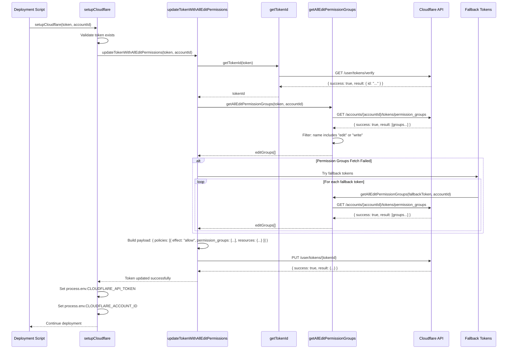
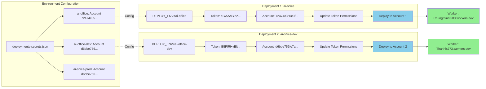
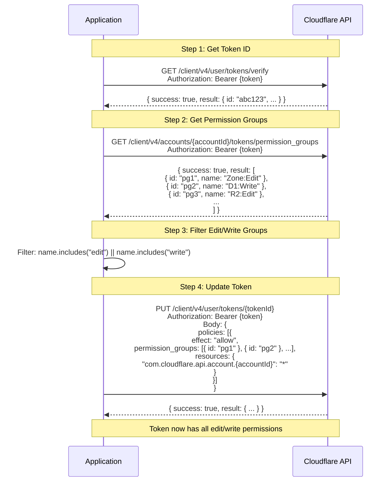

# Cloudflare API Token Auto-Update Solution Architecture

## Problem Statement

Cloudflare API tokens need specific permissions to perform deployment operations (D1, R2, Workers, Pages, etc.). Manually configuring tokens with all required permissions is:
- Time-consuming
- Error-prone
- Requires deep knowledge of Cloudflare permission structure
- Needs to be repeated for each new token/environment

## Solution Architecture

### Overview
Automatically update an existing Cloudflare API token with all "Edit" and "Write" permissions during deployment, eliminating manual permission configuration.

### Key Components

1. **Token ID Resolution**: Get the token's internal ID from Cloudflare
2. **Permission Group Discovery**: Fetch all available "Edit" and "Write" permission groups
3. **Token Update**: Update the token via Cloudflare API with all discovered permissions
4. **Fallback Mechanism**: Use tokens from other environments if current token can't read permission groups

### Architecture Flow

```
┌─────────────────────────────────────────────────────────────┐
│  Deployment Script Starts                                    │
└────────────────────┬────────────────────────────────────────┘
                     │
                     ▼
┌─────────────────────────────────────────────────────────────┐
│  setupCloudflare(env)                                       │
│  - Reads token from config                                  │
│  - Validates token                                          │
└────────────────────┬────────────────────────────────────────┘
                     │
                     ▼
┌─────────────────────────────────────────────────────────────┐
│  updateTokenWithAllEditPermissions(token, accountId)       │
│                                                              │
│  Step 1: getTokenId(token)                                  │
│  └─> GET /client/v4/user/tokens/verify                      │
│                                                              │
│  Step 2: getAllEditPermissionGroups(token, accountId)       │
│  └─> GET /client/v4/accounts/{accountId}/tokens/            │
│      permission_groups                                       │
│  └─> Filter: name includes "edit" or "write"                │
│                                                              │
│  Step 3: PUT /client/v4/user/tokens/{tokenId}                │
│  └─> Body: { policies: [{ effect: "allow",                  │
│                           permission_groups: [...],         │
│                           resources: {...} }] }             │
└────────────────────┬────────────────────────────────────────┘
                     │
                     ▼
┌─────────────────────────────────────────────────────────────┐
│  Token Updated with Full Permissions                        │
│  - All Edit/Write permissions assigned                      │
│  - Account-scoped resources configured                      │
└─────────────────────────────────────────────────────────────┘
```

## System Flow Diagrams (Mermaid)

### Complete System Flow

```mermaid
flowchart TD
    A[Deployment Script Starts] --> B[Load Config from deployments-secrets.json]
    B --> C{Environment Selected?}
    C -->|DEPLOY_ENV=ai-office| D[Load ai-office Config]
    C -->|DEPLOY_ENV=ai-office-dev| E[Load ai-office-dev Config]
    C -->|Default| F[Load production Config]
    
    D --> G[Extract Token & Account ID]
    E --> G
    F --> G
    
    G --> H[setupCloudflare]
    H --> I[Validate Token]
    I -->|Invalid| J[Error: Token Invalid]
    I -->|Valid| K[updateTokenWithAllEditPermissions]
    
    K --> L[getTokenId]
    L --> M[GET /user/tokens/verify]
    M -->|Success| N[Extract Token ID]
    M -->|Error| O[Error: Cannot Get Token ID]
    
    N --> P[getAllEditPermissionGroups]
    P --> Q[GET /accounts/{id}/tokens/permission_groups]
    Q -->|Success| R[Filter Edit/Write Groups]
    Q -->|Error| S[Try Fallback Tokens]
    
    S --> T{Has Fallback Tokens?}
    T -->|Yes| U[Try Each Fallback Token]
    T -->|No| V[Error: Cannot Get Permission Groups]
    U -->|Success| R
    U -->|All Failed| V
    
    R --> W[Build Token Update Payload]
    W --> X[PUT /user/tokens/{tokenId}]
    X -->|Success| Y[Token Updated with Full Permissions]
    X -->|Error| Z[Error: Update Failed]
    
    Y --> AA[Set Environment Variables]
    AA --> AB[CLOUDFLARE_API_TOKEN]
    AA --> AC[CLOUDFLARE_ACCOUNT_ID]
    
    AB --> AD[Continue Deployment]
    AC --> AD
    AD --> AE[Deploy D1, R2, Workers, Pages]
    
    style Y fill:#90EE90
    style J fill:#FFB6C1
    style O fill:#FFB6C1
    style V fill:#FFB6C1
    style Z fill:#FFB6C1
```

### Token Update Process Detail



### Multi-Account Deployment Flow



### Fallback Token Mechanism

```mermaid
flowchart TD
    A[updateTokenWithAllEditPermissions] --> B[Try getTokenId with current token]
    B -->|Success| C[Try getAllEditPermissionGroups with current token]
    B -->|Error| Z[Error: Invalid Token]
    
    C -->|Success| D[Filter Edit/Write Groups]
    C -->|Error| E[Permission Groups Fetch Failed]
    
    E --> F{Has Fallback Tokens?}
    F -->|No| G[Error: Cannot Get Permission Groups]
    F -->|Yes| H[Load Fallback Tokens from Config]
    
    H --> I[Loop Through Fallback Tokens]
    I --> J[Try getAllEditPermissionGroups with Fallback Token]
    J -->|Success| D
    J -->|Error| K{More Fallback Tokens?}
    K -->|Yes| I
    K -->|No| G
    
    D --> L{Edit Groups Found?}
    L -->|No| M[Error: No Edit Groups Found]
    L -->|Yes| N[Build Token Update Payload]
    
    N --> O[PUT /user/tokens/{tokenId}]
    O -->|Success| P[Token Updated Successfully]
    O -->|Error| Q[Error: Update Failed]
    
    style P fill:#90EE90
    style Z fill:#FFB6C1
    style G fill:#FFB6C1
    style M fill:#FFB6C1
    style Q fill:#FFB6C1
```

### API Interaction Flow



### Component Architecture

```mermaid
graph TB
    subgraph "Configuration Layer"
        CFG[deployments-secrets.json]
        ENV[DEPLOY_ENV Environment Variable]
    end
    
    subgraph "Core Functions"
        GTI[getTokenId]
        GEPG[getAllEditPermissionGroups]
        UT[updateTokenWithAllEditPermissions]
    end
    
    subgraph "Integration Layer"
        SC[setupCloudflare]
        LC[loadConfig]
        PC[parseConfig]
    end
    
    subgraph "Cloudflare API"
        API1[/user/tokens/verify]
        API2[/accounts/{id}/tokens/permission_groups]
        API3[/user/tokens/{id}]
    end
    
    subgraph "Deployment Layer"
        DD1[D1 Database]
        DR2[R2 Bucket]
        DW[Workers]
        DP[Pages]
    end
    
    ENV --> LC
    CFG --> LC
    LC --> PC
    PC --> SC
    
    SC --> UT
    UT --> GTI
    UT --> GEPG
    
    GTI --> API1
    GEPG --> API2
    UT --> API3
    
    SC --> DD1
    SC --> DR2
    SC --> DW
    SC --> DP
    
    style UT fill:#FFD700
    style SC fill:#87CEEB
    style API3 fill:#90EE90
```

## Implementation Guide

### Prerequisites

- Node.js with `https` module (built-in)
- Cloudflare API token (can be minimal initially)
- Account ID where token will be used

### Step 1: Core Functions

#### 1.1 Get Token ID

```javascript
const https = require('https');

async function getTokenId(token) {
  return new Promise((resolve, reject) => {
    const req = https.request({
      hostname: 'api.cloudflare.com',
      path: '/client/v4/user/tokens/verify',
      method: 'GET',
      headers: {
        'Authorization': `Bearer ${token}`,
        'Content-Type': 'application/json'
      },
      timeout: 30000
    }, (res) => {
      let data = '';
      res.on('data', (chunk) => data += chunk);
      res.on('end', () => {
        try {
          const json = JSON.parse(data);
          if (!json.success || !json.result?.id) {
            reject(new Error(`Failed to get token ID: ${JSON.stringify(json.errors || json)}`));
            return;
          }
          resolve(json.result.id);
        } catch (e) {
          reject(e);
        }
      });
    });
    req.on('error', reject);
    req.setTimeout(30000, () => { req.destroy(); reject(new Error('Request timeout')); });
    req.end();
  });
}
```

#### 1.2 Get All Edit Permission Groups

```javascript
async function getAllEditPermissionGroups(token, accountId) {
  return new Promise((resolve, reject) => {
    const req = https.request({
      hostname: 'api.cloudflare.com',
      path: `/client/v4/accounts/${accountId}/tokens/permission_groups`,
      method: 'GET',
      headers: {
        'Authorization': `Bearer ${token}`,
        'Content-Type': 'application/json'
      },
      timeout: 30000
    }, (res) => {
      let data = '';
      res.on('data', (chunk) => data += chunk);
      res.on('end', () => {
        try {
          const json = JSON.parse(data);
          if (!json.success) {
            reject(new Error(`Failed to get permission groups: ${JSON.stringify(json.errors)}`));
            return;
          }
          const allGroups = json.result || [];
          const editGroups = allGroups.filter(g => {
            const name = (g.name || '').toLowerCase();
            return name.includes('edit') || name.includes('write');
          });
          resolve(editGroups);
        } catch (e) {
          reject(e);
        }
      });
    });
    req.on('error', reject);
    req.setTimeout(30000, () => { req.destroy(); reject(new Error('Request timeout')); });
    req.end();
  });
}
```

#### 1.3 Update Token with All Edit Permissions

```javascript
const fs = require('fs');
const path = require('path');

async function updateTokenWithAllEditPermissions(currentToken, accountId, fallbackTokens = []) {
  const tokenId = await getTokenId(currentToken);
  
  let editGroups;
  let permissionGroupsError = null;
  
  try {
    editGroups = await getAllEditPermissionGroups(currentToken, accountId);
  } catch (error) {
    permissionGroupsError = error;
    
    if (fallbackTokens.length > 0) {
      for (const fallbackToken of fallbackTokens) {
        try {
          const fallbackAccountId = fallbackToken.accountId || accountId;
          editGroups = await getAllEditPermissionGroups(fallbackToken.token, fallbackAccountId);
          console.log(`✓ Using permission groups from fallback token (account: ${fallbackAccountId})`);
          break;
        } catch (e) {
          continue;
        }
      }
    }
    
    if (!editGroups || editGroups.length === 0) {
      throw new Error(
        `Cannot get permission groups. Current token error: ${permissionGroupsError.message}. ` +
        `Please ensure your token has access to read permission groups, or provide a working ` +
        `fallback token with permission to read permission groups.`
      );
    }
  }
  
  if (editGroups.length === 0) {
    throw new Error('No edit permission groups found');
  }

  const tokenData = {
    policies: [{
      effect: 'allow',
      permission_groups: editGroups.map(g => ({ id: g.id })),
      resources: {
        [`com.cloudflare.api.account.${accountId}`]: '*'
      }
    }]
  };

  return new Promise((resolve, reject) => {
    const postData = JSON.stringify(tokenData);
    const req = https.request({
      hostname: 'api.cloudflare.com',
      path: `/client/v4/user/tokens/${tokenId}`,
      method: 'PUT',
      headers: {
        'Authorization': `Bearer ${currentToken}`,
        'Content-Type': 'application/json',
        'Content-Length': Buffer.byteLength(postData)
      },
      timeout: 30000
    }, (res) => {
      let data = '';
      res.on('data', (chunk) => data += chunk);
      res.on('end', () => {
        try {
          const json = JSON.parse(data);
          if (!json.success) {
            reject(new Error(`Failed to update token: ${JSON.stringify(json.errors)}`));
            return;
          }
          resolve(json.result);
        } catch (e) {
          reject(e);
        }
      });
    });
    req.on('error', reject);
    req.setTimeout(30000, () => { req.destroy(); reject(new Error('Request timeout')); });
    req.write(postData);
    req.end();
  });
}
```

### Step 2: Integration Example

#### 2.1 Standalone Script

```javascript
const https = require('https');

async function main() {
  const token = process.env.CLOUDFLARE_API_TOKEN || 'YOUR_TOKEN_HERE';
  const accountId = process.env.CLOUDFLARE_ACCOUNT_ID || 'YOUR_ACCOUNT_ID_HERE';
  
  if (!token || token === 'YOUR_TOKEN_HERE') {
    console.error('Error: CLOUDFLARE_API_TOKEN environment variable required');
    process.exit(1);
  }
  
  if (!accountId || accountId === 'YOUR_ACCOUNT_ID_HERE') {
    console.error('Error: CLOUDFLARE_ACCOUNT_ID environment variable required');
    process.exit(1);
  }
  
  try {
    console.log('🔄 Updating token with all edit permissions...');
    await updateTokenWithAllEditPermissions(token, accountId);
    console.log('✅ Token updated successfully with all edit permissions!');
  } catch (error) {
    console.error('❌ Failed to update token:', error.message);
    process.exit(1);
  }
}

if (require.main === module) {
  main();
}

module.exports = { updateTokenWithAllEditPermissions, getTokenId, getAllEditPermissionGroups };
```

#### 2.2 Integration into Deployment Script

```javascript
async function setupCloudflare(token, accountId, fallbackTokens = []) {
  console.log('Setting up Cloudflare credentials...');
  
  if (!token) {
    throw new Error('API token is required');
  }
  
  if (!accountId) {
    throw new Error('Account ID is required');
  }
  
  console.log('Updating API token with all edit permissions...');
  try {
    await updateTokenWithAllEditPermissions(token, accountId, fallbackTokens);
    console.log('✅ Token updated with all edit permissions');
    
    process.env.CLOUDFLARE_API_TOKEN = token;
    process.env.CLOUDFLARE_ACCOUNT_ID = accountId;
    
    return { accountId, apiToken: token };
  } catch (error) {
    throw new Error(
      `Failed to update token with all edit permissions: ${error.message}. ` +
      `Please ensure your token has "User API Tokens:Edit" permission.`
    );
  }
}
```

### Step 3: Usage Examples

#### 3.1 Command Line Usage

```bash
# Set environment variables
export CLOUDFLARE_API_TOKEN="your-token-here"
export CLOUDFLARE_ACCOUNT_ID="your-account-id-here"

# Run the update script
node update-token-permissions.js
```

#### 3.2 Programmatic Usage

```javascript
const { updateTokenWithAllEditPermissions } = require('./cloudflare-token-updater');

async function deploy() {
  const token = 'your-token-here';
  const accountId = 'your-account-id-here';
  
  await updateTokenWithAllEditPermissions(token, accountId);
  
  process.env.CLOUDFLARE_API_TOKEN = token;
  process.env.CLOUDFLARE_ACCOUNT_ID = accountId;
  
  // Continue with deployment...
}
```

#### 3.3 With Fallback Tokens

```javascript
const fallbackTokens = [
  { token: 'token-from-env-1', accountId: 'account-1' },
  { token: 'token-from-env-2', accountId: 'account-2' }
];

await updateTokenWithAllEditPermissions(currentToken, accountId, fallbackTokens);
```

## API Endpoints Reference

### 1. Get Token ID
- **Endpoint**: `GET /client/v4/user/tokens/verify`
- **Headers**: `Authorization: Bearer {token}`
- **Response**: `{ success: true, result: { id: "token-id", ... } }`

### 2. Get Permission Groups
- **Endpoint**: `GET /client/v4/accounts/{accountId}/tokens/permission_groups`
- **Headers**: `Authorization: Bearer {token}`
- **Response**: `{ success: true, result: [{ id: "...", name: "...", ... }, ...] }`

### 3. Update Token
- **Endpoint**: `PUT /client/v4/user/tokens/{tokenId}`
- **Headers**: `Authorization: Bearer {token}`, `Content-Type: application/json`
- **Body**:
```json
{
  "policies": [{
    "effect": "allow",
    "permission_groups": [
      { "id": "permission-group-id-1" },
      { "id": "permission-group-id-2" }
    ],
    "resources": {
      "com.cloudflare.api.account.{accountId}": "*"
    }
  }]
}
```

## Error Handling

### Common Errors

1. **"Failed to get token ID"**
   - **Cause**: Invalid or expired token
   - **Solution**: Verify token is valid and not expired

2. **"Failed to get permission groups"**
   - **Cause**: Token lacks permission to read permission groups
   - **Solution**: Use fallback token mechanism or ensure token has basic read permissions

3. **"Failed to update token: effect must be present"**
   - **Cause**: Missing `effect: "allow"` in policy
   - **Solution**: Ensure policy includes `effect: "allow"`

4. **"account is not a valid resource name"**
   - **Cause**: Incorrect resource format
   - **Solution**: Use format `com.cloudflare.api.account.{accountId}` not `account: { id: ... }`

5. **"Token lacks permission to update itself"**
   - **Cause**: Token doesn't have "User API Tokens:Edit" permission
   - **Solution**: Token must have at least "User API Tokens:Edit" to update itself

## Security Considerations

1. **Token Storage**: Never commit tokens to version control. Use environment variables or secure secret management.

2. **Token Permissions**: The token being updated must have "User API Tokens:Edit" permission to update itself.

3. **Account Scoping**: Permissions are scoped to the specific account ID. Ensure you're using the correct account.

4. **Fallback Tokens**: Fallback tokens should be from trusted sources and have appropriate permissions.

## Testing

### Test Token Update

```javascript
async function testTokenUpdate() {
  const token = process.env.TEST_TOKEN;
  const accountId = process.env.TEST_ACCOUNT_ID;
  
  try {
    console.log('Testing token update...');
    const result = await updateTokenWithAllEditPermissions(token, accountId);
    console.log('✅ Test passed:', result);
  } catch (error) {
    console.error('❌ Test failed:', error.message);
    throw error;
  }
}
```

### Verify Token Permissions

```bash
curl "https://api.cloudflare.com/client/v4/user/tokens/verify" \
  -H "Authorization: Bearer YOUR_TOKEN" \
  | jq '.result.permissions'
```

## Complete Standalone Implementation

Save as `cloudflare-token-updater.js`:

```javascript
const https = require('https');

async function getTokenId(token) {
  return new Promise((resolve, reject) => {
    const req = https.request({
      hostname: 'api.cloudflare.com',
      path: '/client/v4/user/tokens/verify',
      method: 'GET',
      headers: {
        'Authorization': `Bearer ${token}`,
        'Content-Type': 'application/json'
      },
      timeout: 30000
    }, (res) => {
      let data = '';
      res.on('data', (chunk) => data += chunk);
      res.on('end', () => {
        try {
          const json = JSON.parse(data);
          if (!json.success || !json.result?.id) {
            reject(new Error(`Failed to get token ID: ${JSON.stringify(json.errors || json)}`));
            return;
          }
          resolve(json.result.id);
        } catch (e) {
          reject(e);
        }
      });
    });
    req.on('error', reject);
    req.setTimeout(30000, () => { req.destroy(); reject(new Error('Request timeout')); });
    req.end();
  });
}

async function getAllEditPermissionGroups(token, accountId) {
  return new Promise((resolve, reject) => {
    const req = https.request({
      hostname: 'api.cloudflare.com',
      path: `/client/v4/accounts/${accountId}/tokens/permission_groups`,
      method: 'GET',
      headers: {
        'Authorization': `Bearer ${token}`,
        'Content-Type': 'application/json'
      },
      timeout: 30000
    }, (res) => {
      let data = '';
      res.on('data', (chunk) => data += chunk);
      res.on('end', () => {
        try {
          const json = JSON.parse(data);
          if (!json.success) {
            reject(new Error(`Failed to get permission groups: ${JSON.stringify(json.errors)}`));
            return;
          }
          const allGroups = json.result || [];
          const editGroups = allGroups.filter(g => {
            const name = (g.name || '').toLowerCase();
            return name.includes('edit') || name.includes('write');
          });
          resolve(editGroups);
        } catch (e) {
          reject(e);
        }
      });
    });
    req.on('error', reject);
    req.setTimeout(30000, () => { req.destroy(); reject(new Error('Request timeout')); });
    req.end();
  });
}

async function updateTokenWithAllEditPermissions(currentToken, accountId, fallbackTokens = []) {
  const tokenId = await getTokenId(currentToken);
  
  let editGroups;
  let permissionGroupsError = null;
  
  try {
    editGroups = await getAllEditPermissionGroups(currentToken, accountId);
  } catch (error) {
    permissionGroupsError = error;
    
    if (fallbackTokens.length > 0) {
      for (const fallbackToken of fallbackTokens) {
        try {
          const fallbackAccountId = fallbackToken.accountId || accountId;
          editGroups = await getAllEditPermissionGroups(fallbackToken.token, fallbackAccountId);
          console.log(`✓ Using permission groups from fallback token (account: ${fallbackAccountId})`);
          break;
        } catch (e) {
          continue;
        }
      }
    }
    
    if (!editGroups || editGroups.length === 0) {
      throw new Error(
        `Cannot get permission groups. Current token error: ${permissionGroupsError.message}. ` +
        `Please ensure your token has access to read permission groups, or provide a working ` +
        `fallback token with permission to read permission groups.`
      );
    }
  }
  
  if (editGroups.length === 0) {
    throw new Error('No edit permission groups found');
  }

  const tokenData = {
    policies: [{
      effect: 'allow',
      permission_groups: editGroups.map(g => ({ id: g.id })),
      resources: {
        [`com.cloudflare.api.account.${accountId}`]: '*'
      }
    }]
  };

  return new Promise((resolve, reject) => {
    const postData = JSON.stringify(tokenData);
    const req = https.request({
      hostname: 'api.cloudflare.com',
      path: `/client/v4/user/tokens/${tokenId}`,
      method: 'PUT',
      headers: {
        'Authorization': `Bearer ${currentToken}`,
        'Content-Type': 'application/json',
        'Content-Length': Buffer.byteLength(postData)
      },
      timeout: 30000
    }, (res) => {
      let data = '';
      res.on('data', (chunk) => data += chunk);
      res.on('end', () => {
        try {
          const json = JSON.parse(data);
          if (!json.success) {
            reject(new Error(`Failed to update token: ${JSON.stringify(json.errors)}`));
            return;
          }
          resolve(json.result);
        } catch (e) {
          reject(e);
        }
      });
    });
    req.on('error', reject);
    req.setTimeout(30000, () => { req.destroy(); reject(new Error('Request timeout')); });
    req.write(postData);
    req.end();
  });
}

if (require.main === module) {
  (async () => {
    const token = process.env.CLOUDFLARE_API_TOKEN;
    const accountId = process.env.CLOUDFLARE_ACCOUNT_ID;
    
    if (!token) {
      console.error('Error: CLOUDFLARE_API_TOKEN environment variable required');
      process.exit(1);
    }
    
    if (!accountId) {
      console.error('Error: CLOUDFLARE_ACCOUNT_ID environment variable required');
      process.exit(1);
    }
    
    try {
      console.log('🔄 Updating token with all edit permissions...');
      await updateTokenWithAllEditPermissions(token, accountId);
      console.log('✅ Token updated successfully with all edit permissions!');
    } catch (error) {
      console.error('❌ Failed to update token:', error.message);
      process.exit(1);
    }
  })();
}

module.exports = { updateTokenWithAllEditPermissions, getTokenId, getAllEditPermissionGroups };
```

## Summary

This solution automatically updates Cloudflare API tokens with all necessary edit/write permissions during deployment, eliminating manual configuration. The implementation:

1. **Fetches all edit/write permission groups** from Cloudflare API
2. **Updates the token** with all discovered permissions
3. **Supports fallback tokens** if current token can't read permission groups
4. **Requires minimal initial permissions** (just "User API Tokens:Edit" to update itself)

The token in your configuration file doesn't need full permissions initially - the code updates it automatically during deployment.


---

# System Requirements & User Journey Guide

## Physical Machine Requirements

### Minimum Hardware Specifications

**For Development/Testing:**
- **CPU**: 2 cores (Intel/AMD x64 or Apple Silicon M1/M2)
- **RAM**: 4 GB minimum, 8 GB recommended
- **Storage**: 5 GB free disk space
- **Network**: Stable internet connection (minimum 5 Mbps)

**For Production Deployments:**
- **CPU**: 4+ cores recommended
- **RAM**: 8 GB minimum, 16 GB recommended
- **Storage**: 10 GB free disk space
- **Network**: Reliable internet connection (10+ Mbps recommended)

### Operating System Support

**Supported Operating Systems:**
- ✅ **macOS**: 10.15 (Catalina) or later (Intel/Apple Silicon)
- ✅ **Linux**: Ubuntu 18.04+, Debian 10+, CentOS 7+, or any modern Linux distribution
- ✅ **Windows**: Windows 10/11 (using WSL 2 recommended) or Windows Server 2019+

**Recommended:**
- macOS 12+ (Monterey) or later
- Ubuntu 20.04 LTS or later
- Windows 11 with WSL 2 (Ubuntu 20.04)

### Required Software

1. **Node.js**: Version 16.x or higher (18.x LTS recommended)
2. **npm**: Version 8.x or higher (comes with Node.js)
3. **Git**: Version 2.20+ (for cloning repositories)
4. **Text Editor**: VS Code, Vim, Nano, or any code editor

### Optional but Recommended

- **Cloudflare Wrangler CLI**: For manual testing (installed automatically by script)
- **Google Cloud SDK (gcloud)**: If deploying to GCP services
- **curl**: For API testing
- **jq**: For JSON parsing in terminal

---

## Environment Setup Guide

### Step 1: Install Node.js

**macOS (using Homebrew):**
```bash
# Install Homebrew if not installed
/bin/bash -c "$(curl -fsSL https://raw.githubusercontent.com/Homebrew/install/HEAD/install.sh)"

# Install Node.js
brew install node@18

# Verify installation
node --version  # Should show v18.x.x or higher
npm --version   # Should show 8.x.x or higher
```

**Linux (Ubuntu/Debian):**
```bash
# Update package list
sudo apt update

# Install Node.js 18.x
curl -fsSL https://deb.nodesource.com/setup_18.x | sudo -E bash -
sudo apt install -y nodejs

# Verify installation
node --version
npm --version
```

**Windows:**
1. Download Node.js installer from https://nodejs.org/
2. Run installer (choose LTS version 18.x or higher)
3. Verify in PowerShell:
```powershell
node --version
npm --version
```

### Step 2: Clone or Download Project

```bash
# If using Git
git clone <your-repository-url>
cd <project-directory>

# Or download and extract ZIP file
# Then navigate to project directory
cd <project-directory>
```

### Step 3: Install Project Dependencies

```bash
# Install npm packages (if package.json exists)
npm install

# Or if no package.json, ensure you have the required files:
# - deploy.js
# - cloudflare-token-updater.js
# - deployments-secrets.json (create this)
```

### Step 4: Create Configuration File

Create `deployments-secrets.json` in `_deploy-cli-cloudflare-gcp/` directory:

```bash
mkdir -p _deploy-cli-cloudflare-gcp
cd _deploy-cli-cloudflare-gcp
```

Create `deployments-secrets.json` with this structure:

```json
{
  "environments": {
    "production": {
      "name": "production",
      "workerName": "your-worker-name",
      "pagesProjectName": "your-pages-project",
      "databaseName": "your-database-name",
      "bucketName": "your-bucket-name",
      "cloudflare": {
        "accountId": "your-cloudflare-account-id",
        "apiToken": "your-cloudflare-api-token"
      }
    }
  }
}
```

### Step 5: Get Cloudflare Credentials

**Getting Account ID:**
1. Log in to Cloudflare Dashboard: https://dash.cloudflare.com/
2. Select your account
3. Copy Account ID from right sidebar (or from URL: `dash.cloudflare.com/{accountId}/...`)

**Creating API Token:**
1. Go to: https://dash.cloudflare.com/profile/api-tokens
2. Click "Create Token"
3. Use "Edit Cloudflare Workers" template OR create custom token with:
   - **Permission**: "User API Tokens:Edit" (minimum required)
   - **Account Resources**: Include your account
4. Copy the token immediately (you won't see it again!)

### Step 6: Set Up Environment Variables (Optional)

You can set environment variables instead of using config file:

```bash
# macOS/Linux
export CLOUDFLARE_API_TOKEN="your-token-here"
export CLOUDFLARE_ACCOUNT_ID="your-account-id-here"
export DEPLOY_ENV="production"

# Windows (PowerShell)
$env:CLOUDFLARE_API_TOKEN="your-token-here"
$env:CLOUDFLARE_ACCOUNT_ID="your-account-id-here"
$env:DEPLOY_ENV="production"
```

---

## Complete User Journey: Deployment Process

### Pre-Deployment Checklist

Before starting deployment, the user should verify:

- [ ] Node.js is installed and working
- [ ] Project files are in place
- [ ] `deployments-secrets.json` is configured
- [ ] Cloudflare API token is valid
- [ ] Account ID is correct
- [ ] Internet connection is stable
- [ ] Terminal/Command Prompt is ready

### User Journey: First-Time Deployment

#### **Step 1: User Opens Terminal**

**What the user sees:**
```
$ cd /path/to/project
$ ls
deploy.js  deployments-secrets.json  ...
```

**What the user does:**
- Navigates to project directory
- Verifies files are present

---

#### **Step 2: User Reviews Configuration**

**What the user sees:**
```bash
$ cat deployments-secrets.json
{
  "environments": {
    "production": {
      "cloudflare": {
        "accountId": "72474c350e3f55d96195536a5d39e00d",
        "apiToken": "e-w5AMYn2MgkR7nt-VjKAqNbjDgvTX7tWSU0K0Nr"
      }
    }
  }
}
```

**What the user does:**
- Opens `deployments-secrets.json` in editor
- Verifies account ID and token are correct
- Saves file if changes were made

**User's mental state:**
- "Is my token correct?"
- "Do I have the right account ID?"
- "Are all my settings correct?"

---

#### **Step 3: User Runs Deployment Command**

**What the user types:**
```bash
$ DEPLOY_ENV=production DEPLOY_PAGES=true node _deploy-cli-cloudflare-gcp/deploy.js
```

**What the user sees (Initial Output):**
```
╔══════════════════════════════════════════════════════════════════════════════════════════════════╗
║  📊 Deployment Progress                                                                         ║
╚══════════════════════════════════════════════════════════════════════════════════════════════════╝

[1/10] ⏳ Loading configuration...
[2/10] ⏳ Checking prerequisites...
[3/10] ⏳ Authenticating with GCP...
[4/10] ⏳ Checking GCP APIs...
[5/10] ⏳ Setting up Cloudflare credentials...
[6/10] ⏳ [Cloudflare] R2 Bucket: faceswap-images...
[7/10] ⏳ [Cloudflare] D1 Database: faceswap-db...
[8/10] ⏳ Deploying secrets...
[9/10] ⏳ Deploying worker...
[10/10] ⏳ Deploying frontend...
```

**What the user does:**
- Waits and watches the progress
- May feel anxious if it's first time
- Watches for any error messages

**User's mental state:**
- "Is it working?"
- "How long will this take?"
- "I hope nothing breaks..."

---

#### **Step 4: Token Update Process (Automatic)**

**What the user sees:**
```
[5/10] 🔄 Setting up Cloudflare credentials...
      ⚠️  Updating API token with all edit permissions...
      🔄 Getting token ID...
      ✓ Token ID retrieved: abc123def456
      🔄 Fetching permission groups...
      ✓ Found 45 edit/write permission groups
      🔄 Updating token permissions...
      ✓ Token updated with all edit permissions
      ✓ Using API token for account 72474c350e3f55d96195536a5d39e00d
```

**What happens (behind the scenes):**
- Script calls `getTokenId()` → Gets token ID from Cloudflare
- Script calls `getAllEditPermissionGroups()` → Fetches all edit permissions
- Script calls `updateTokenWithAllEditPermissions()` → Updates token via API
- Token now has full permissions

**What the user does:**
- Observes the automatic process
- May not fully understand what's happening (that's okay!)
- Sees success messages

**User's mental state:**
- "It's doing something with my token..."
- "Good, it says 'updated successfully'"
- "I hope this works..."

---

#### **Step 5: Database Setup (Automatic)**

**What the user sees:**
```
[7/10] 🔄 [Cloudflare] D1 Database: faceswap-db...
      🔄 Checking if database exists...
      ✓ Database exists
      🔄 Applying schema migrations...
      ✓ Added column: profile_id
      ✓ Added column: preset_id
      ✓ Schema updated successfully
```

**What happens (behind the scenes):**
- Script checks if D1 database exists
- If exists, checks schema and adds missing columns
- If not exists, creates database and applies full schema

**What the user does:**
- Watches progress
- Sees database operations completing

**User's mental state:**
- "Database is being set up..."
- "Good, it's adding the columns I need"

---

#### **Step 6: R2 Bucket Setup (Automatic)**

**What the user sees:**
```
[6/10] 🔄 [Cloudflare] R2 Bucket: faceswap-images...
      🔄 Checking if bucket exists...
      ✓ Bucket exists
      ✓ R2 bucket ready
```

**What happens (behind the scenes):**
- Script checks if R2 bucket exists
- Creates bucket if it doesn't exist
- Verifies bucket is accessible

**What the user does:**
- Observes the process
- Sees success confirmation

---

#### **Step 7: Secrets Deployment (Automatic)**

**What the user sees:**
```
[8/10] 🔄 Deploying secrets...
      🔄 Setting secret: RAPIDAPI_KEY
      ✓ Secret set: RAPIDAPI_KEY
      🔄 Setting secret: GOOGLE_VISION_API_KEY
      ✓ Secret set: GOOGLE_VISION_API_KEY
      ✓ All secrets deployed
```

**What happens (behind the scenes):**
- Script reads secrets from config
- Uses `wrangler secret put` to set each secret
- Verifies secrets are set

**What the user does:**
- Watches secrets being set
- May feel relieved if sensitive data is handled correctly

---

#### **Step 8: Worker Deployment (Automatic)**

**What the user sees:**
```
[9/10] 🔄 Deploying worker...
      🔄 Building worker...
      ✓ Worker built successfully
      🔄 Uploading to Cloudflare...
      ✓ Worker deployed: https://your-worker.your-subdomain.workers.dev
```

**What happens (behind the scenes):**
- Script builds worker code
- Uploads to Cloudflare Workers
- Configures routes and bindings
- Returns worker URL

**What the user does:**
- Waits for deployment
- Gets excited when URL appears
- May copy URL to test

**User's mental state:**
- "Almost done!"
- "I can see my worker URL!"
- "Let me test it when it's done"

---

#### **Step 9: Frontend Deployment (Automatic)**

**What the user sees:**
```
[10/10] 🔄 Deploying frontend...
       🔄 Uploading frontend files...
       ✓ Frontend deployed: https://your-project.pages.dev
```

**What happens (behind the scenes):**
- Script uploads frontend files to Cloudflare Pages
- Configures build settings
- Returns Pages URL

**What the user does:**
- Sees final deployment step
- Gets frontend URL
- May open URL in browser immediately

---

#### **Step 10: Deployment Complete**

**What the user sees:**
```
╔══════════════════════════════════════════════════════════════════════════════════════════════════╗
║  📊 Deployment Summary                                                                          ║
╚══════════════════════════════════════════════════════════════════════════════════════════════════╝

✓ Deployment completed successfully!

Backend Worker: https://your-worker.your-subdomain.workers.dev
Frontend Pages: https://your-project.pages.dev

Progress: ████████████████████████████████████ 100%
Summary: 10✓ 0✗ 0⚠ 0⟳ 0⊘ | 10 total
Elapsed: 45.3s
```

**What the user does:**
- Reads the summary
- Copies URLs to test
- Feels accomplished!
- May share URLs with team

**User's mental state:**
- "Success! Everything worked!"
- "Let me test these URLs"
- "I should save these URLs somewhere"
- "That was easier than I thought!"

---

### User Journey: Subsequent Deployments

For subsequent deployments, the user journey is simpler:

#### **Step 1: User Makes Code Changes**

**What the user does:**
- Edits code files
- Tests locally (optional)
- Commits changes (optional)

#### **Step 2: User Runs Same Command**

```bash
$ DEPLOY_ENV=production DEPLOY_PAGES=true node _deploy-cli-cloudflare-gcp/deploy.js
```

**What the user sees:**
- Same progress indicators
- Faster execution (token already has permissions)
- Updated URLs (if changed)

**User's mental state:**
- "This is routine now"
- "I know what to expect"
- "It should work like last time"

---

### User Journey: Multi-Account Deployment

#### **Scenario: Deploying to Development Environment**

**Step 1: User Sets Environment Variable**
```bash
$ DEPLOY_ENV=ai-office-dev node _deploy-cli-cloudflare-gcp/deploy.js
```

**What the user sees:**
```
[5/10] 🔄 Setting up Cloudflare credentials...
      ✓ Using account: d6bbe756fe7a10cc4982a882cd98c9c8
      ✓ Token updated with all edit permissions
```

**What happens:**
- Script reads `ai-office-dev` config from `deployments-secrets.json`
- Uses different account ID and token
- Updates that token's permissions
- Deploys to different account

**User's mental state:**
- "I'm deploying to dev now"
- "Different account, same process"
- "This is convenient"

#### **Scenario: Deploying to Production Environment**

**Step 1: User Sets Different Environment**
```bash
$ DEPLOY_ENV=ai-office node _deploy-cli-cloudflare-gcp/deploy.js
```

**What the user sees:**
```
[5/10] 🔄 Setting up Cloudflare credentials...
      ✓ Using account: 72474c350e3f55d96195536a5d39e00d
      ✓ Token updated with all edit permissions
```

**What happens:**
- Script switches to production account
- Uses production token
- Deploys to production account

**User's mental state:**
- "Now deploying to production"
- "I need to be careful"
- "Let me verify everything is correct"

---

## Error Scenarios & User Experience

### Error: Invalid Token

**What the user sees:**
```
[5/10] ❌ Setting up Cloudflare credentials...
      ❌ API token validation failed for environment: production
      ❌ Please check your API token in deployments-secrets.json
```

**What the user does:**
1. Opens `deployments-secrets.json`
2. Checks if token is correct
3. May need to create new token from Cloudflare dashboard
4. Updates token in config file
5. Runs deployment again

**User's mental state:**
- "Oh no, what's wrong?"
- "Let me check my token"
- "I need to fix this"

---

### Error: Token Lacks Permission to Update Itself

**What the user sees:**
```
[5/10] ⚠️  Updating API token with all edit permissions...
      ❌ Failed to update token: Token lacks permission to update itself
      ❌ Please ensure your token has "User API Tokens:Edit" permission
```

**What the user does:**
1. Goes to Cloudflare dashboard
2. Edits the API token
3. Adds "User API Tokens:Edit" permission
4. Saves token
5. Runs deployment again

**User's mental state:**
- "I need to add a permission"
- "Let me fix this in the dashboard"
- "I'll try again after fixing"

---

### Error: Network Timeout

**What the user sees:**
```
[5/10] 🔄 Setting up Cloudflare credentials...
      ⚠️  Request timeout
      🔄 Retrying... (attempt 2/3)
      ✓ Token updated successfully
```

**What happens:**
- Script automatically retries
- Usually succeeds on retry

**User's mental state:**
- "Network issue, but it's retrying"
- "Good, it worked on retry"
- "The script handles this automatically"

---

## User Mental Model

### What Users Think About

**Before First Deployment:**
- "Will this work?"
- "Do I have everything I need?"
- "What if something breaks?"
- "How long will this take?"

**During Deployment:**
- "It's working..."
- "I see progress indicators"
- "I hope it completes successfully"
- "What's happening behind the scenes?"

**After Successful Deployment:**
- "Great! It worked!"
- "I have my URLs"
- "Let me test it"
- "This was easier than expected"

**After Multiple Deployments:**
- "This is routine now"
- "I trust the process"
- "It always works"
- "I can deploy confidently"

---

## Time Expectations

### Typical Deployment Times

- **First Deployment**: 60-90 seconds
  - Token update: 5-10 seconds
  - Database setup: 10-15 seconds
  - R2 setup: 5-10 seconds
  - Secrets: 10-15 seconds
  - Worker: 20-30 seconds
  - Frontend: 15-20 seconds

- **Subsequent Deployments**: 30-45 seconds
  - Token already has permissions (skips update or fast)
  - Database exists (skips creation)
  - Only uploads changed files

- **Multi-Account Switch**: Same as first deployment
  - Each account needs token update
  - Each account has separate resources

---

## User Checklist: Before Deployment

Print this checklist for users:

```
☐ Node.js installed (v16+)
☐ Project files downloaded/cloned
☐ deployments-secrets.json created
☐ Cloudflare account ID copied
☐ Cloudflare API token created
☐ API token has "User API Tokens:Edit" permission
☐ Token and Account ID added to config file
☐ Internet connection stable
☐ Terminal/Command Prompt ready
☐ Ready to deploy!
```

---

## Quick Reference: Common Commands

```bash
# Deploy to production
DEPLOY_ENV=production DEPLOY_PAGES=true node deploy.js

# Deploy to development
DEPLOY_ENV=ai-office-dev DEPLOY_PAGES=true node deploy.js

# Deploy worker only (no frontend)
DEPLOY_ENV=production node deploy.js

# Check Node.js version
node --version

# Verify token manually
curl "https://api.cloudflare.com/client/v4/user/tokens/verify" \
  -H "Authorization: Bearer YOUR_TOKEN"
```

---

This guide covers the complete human experience from setup to deployment, including what users see, do, and think at each step.
