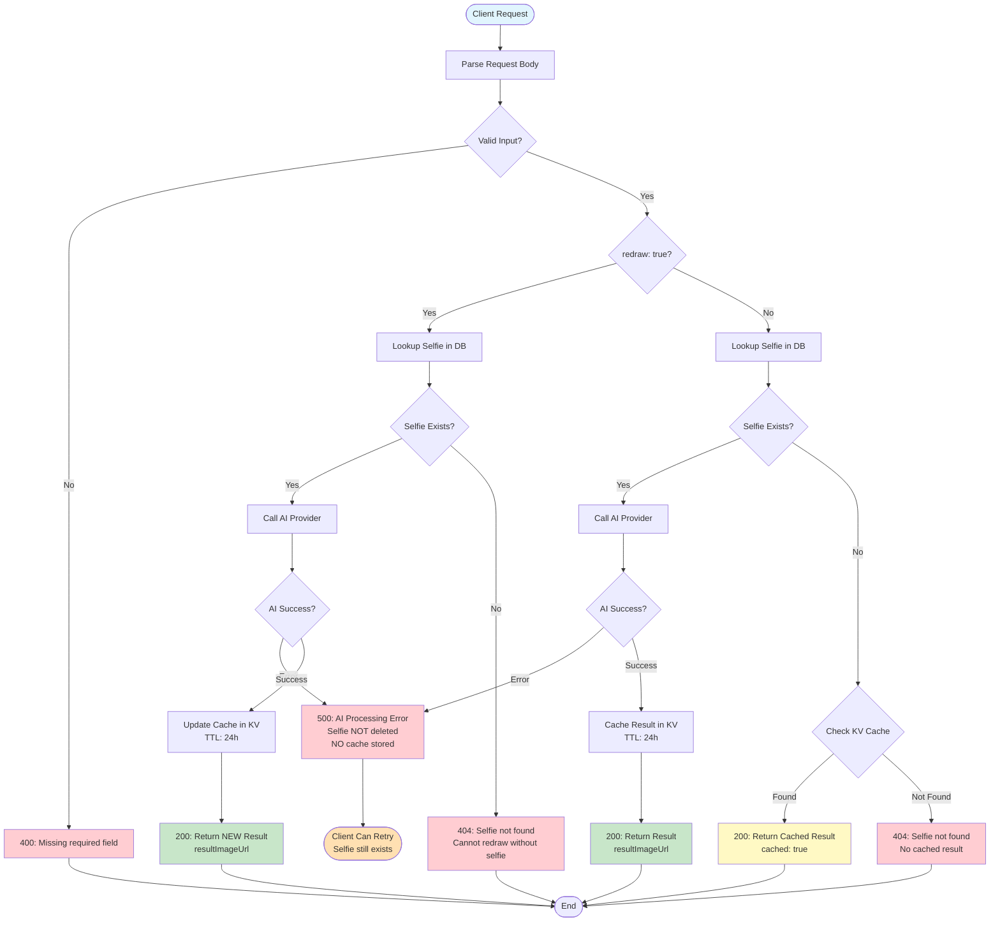

# 2. AI Processing

## 2.1. POST `/faceswap` - Face Swap

**Mục đích:** Thực hiện face swap giữa ảnh preset và ảnh selfie. Hỗ trợ multiple selfies để tạo composite results (ví dụ: wedding photos với cả male và female).

**API làm gì:** Gửi preset + selfie(s) → AI (Vertex dùng prompt_json từ preset; WaveSpeed dùng prompt cố định) thay mặt/đặt người vào preset → trả `resultImageUrl`.

**Lưu ý:**
- Khác với `/background`: FaceSwap thay đổi khuôn mặt trong preset, còn AI Background merge selfie vào preset scene.
- Endpoint này yêu cầu API key authentication khi `ENABLE_MOBILE_API_KEY_AUTH=true`.

**Hành vi theo Provider:**
- **Vertex AI (mặc định):** Sử dụng `prompt_json` từ metadata của preset để thực hiện faceswap.
- **WaveSpeed (`provider: "wavespeed"`):** Không sử dụng `prompt_json`. Sử dụng prompt cố định:
  - **Single mode (1 selfie):** Gửi `[selfie, preset]` với prompt: "Put the person in image1 into image2, keep all the makeup same as preset."
  - **Couple mode (2 selfies):** Gửi `[selfie1, selfie2, preset]` với prompt có cấu trúc Goal/Action/Expressions/Scale/Skin/Body Integrity/Constraints: đặt cả hai người từ Image 1 và Image 2 vào Image 3, giữ nguyên biểu cảm, tỷ lệ cơ thể, và perspective. Bao gồm body integrity checks (không thừa/thiếu ngón tay, tay chân không bị biến dạng) và constraints (không mang phụ kiện từ ảnh nguồn, giữ nguyên filter đen trắng nếu có).

**Request:**

**Sử dụng selfie_ids (từ database):**
```bash
curl -X POST https://api.d.shotpix.app/faceswap \
  -H "Content-Type: application/json" \
  -H "X-API-Key: your_api_key_here" \
  -d '{
    "preset_image_id": "preset_1234567890_abc123",
    "selfie_ids": ["selfie_1234567890_xyz789"],
    "profile_id": "profile_1234567890",
    "additional_prompt": "Add dramatic lighting and cinematic atmosphere",
    "aspect_ratio": "16:9"
  }'
```

**Sử dụng selfie_image_urls (URL trực tiếp):**
```bash
curl -X POST https://api.d.shotpix.app/faceswap \
  -H "Content-Type: application/json" \
  -H "X-API-Key: your_api_key_here" \
  -d '{
    "preset_image_id": "preset_1234567890_abc123",
    "selfie_image_urls": ["https://example.com/selfie1.jpg", "https://example.com/selfie2.jpg"],
    "profile_id": "profile_1234567890",
    "additional_prompt": "Add dramatic lighting and cinematic atmosphere",
    "aspect_ratio": "16:9"
  }'
```

**Request Parameters:**
- `preset_image_id` (string, required): ID ảnh preset đã lưu trong database (format: `preset_...`).
- `selfie_ids` (array of strings, optional): Mảng các ID ảnh selfie đã lưu trong database (hỗ trợ multiple selfies). Thứ tự: [selfie_chính, selfie_phụ] - selfie đầu tiên sẽ được face swap vào preset, selfie thứ hai (nếu có) sẽ được sử dụng làm tham chiếu bổ sung.
- `selfie_image_urls` (array of strings, optional): Mảng các URL ảnh selfie trực tiếp (thay thế cho `selfie_ids`). Hỗ trợ multiple selfies. Phải cung cấp `selfie_ids` HOẶC `selfie_image_urls` (không phải cả hai).
- `profile_id` (string, required): ID profile người dùng.
- `aspect_ratio` (string, optional): Tỷ lệ khung hình (mặc định: "3:4"). Hỗ trợ: "1:1", "3:2", "2:3", "3:4", "4:3", "4:5", "5:4", "9:16", "16:9", "21:9".
  - **Lưu ý về kích thước đầu ra (WaveSpeed provider):** Nếu `aspect_ratio` được chỉ định rõ ràng, hệ thống sẽ sử dụng aspect ratio đó. Nếu không chỉ định hoặc là "original", hệ thống sẽ sử dụng kích thước gốc của selfie (từ trường `dimensions` được lưu khi upload) để giữ nguyên kích thước ảnh đầu ra.
- `additional_prompt` (string, optional): câu mô tả bổ sung, được nối vào cuối trường `prompt` bằng ký tự `+`.

**Response:**
```json
{
  "data": {
    "id": "result_1234567890_abc123",
    "resultImageUrl": "https://resources.d.shotpix.app/faceswap-images/results/result_123.jpg"
  },
  "status": "success",
  "message": "Processing successful",
  "code": 200,
  "debug": {
    "request": {
      "targetUrl": "https://resources.d.shotpix.app/faceswap-images/preset/example.jpg",
      "sourceUrls": [
        "https://resources.d.shotpix.app/faceswap-images/selfie/selfie_001.jpg",
        "https://resources.d.shotpix.app/faceswap-images/selfie/selfie_002.jpg"
      ]
    },
    "provider": {
      "success": true,
      "statusCode": 200,
      "message": "Processing successful",
      "finalResultImageUrl": "https://resources.d.shotpix.app/faceswap-images/results/result_123.jpg",
      "debug": {
        "endpoint": "https://...",
        "status": 200,
        "durationMs": 843
      }
    },
    "vertex": {
      "prompt": { "...": "..." },
      "debug": {
        "endpoint": "https://.../generateContent",
        "status": 200,
        "durationMs": 5180,
        "requestPayload": {
          "promptLength": 746,
          "imageBytes": 921344
        }
      }
    },
    "vision": {
      "checked": false,
      "isSafe": true,
      "error": "Safety check skipped for Vertex AI mode"
    },
    "storage": {
      "attemptedDownload": true,
      "downloadStatus": 200,
      "savedToR2": true,
      "r2Key": "results/result_123.jpg",
      "publicUrl": "https://resources.d.shotpix.app/faceswap-images/results/result_123.jpg"
    },
    "database": {
      "attempted": true,
      "success": true,
      "resultId": "result_..."
    }
  }
}
```

**Error Responses:** Xem [Error Codes Reference](API_TONG_QUAN_VI.md#error-codes-reference)

---

## 2.2. POST `/background` - AI Background

**Mục đích:** Tạo ảnh mới bằng cách đặt selfie (người) vào nền. Hỗ trợ 3 cách cung cấp nền: `preset_image_id`, `preset_image_url`, hoặc `custom_prompt`.

**Luồng xử lý (Logic):**

| Trường hợp | API làm gì |
|------------|------------|
| **Có `custom_prompt`** | Một bước: ghép chuỗi `custom_prompt` của client vào template (có `{{place_holder}}`), gửi **một ảnh selfie** + prompt đó vào [WaveSpeed Seedream v4 edit-sequential](https://wavespeed.ai/models/bytedance/seedream-v4/edit-sequential). Không tạo ảnh nền từ text; chỉ gọi edit với 1 ảnh + prompt. |
| **Không có `custom_prompt`** | Hai thứ: (1) Lấy ảnh nền từ preset (DB hoặc `remove_bg/background/` hoặc URL). (2) Merge: selfie + ảnh nền với prompt merge cố định (Vertex hoặc WaveSpeed), trả về ảnh composite. |

**Lưu ý:** Endpoint này yêu cầu API key authentication khi `ENABLE_MOBILE_API_KEY_AUTH=true`.

**Request:**

**Sử dụng selfie_id (từ database):**
```bash
curl -X POST https://api.d.shotpix.app/background \
  -H "Content-Type: application/json" \
  -H "X-API-Key: your_api_key_here" \
  -d '{
    "preset_image_id": "preset_1234567890_abc123",
    "selfie_id": "selfie_1234567890_xyz789",
    "profile_id": "profile_1234567890",
    "aspect_ratio": "16:9"
  }'
```

**Sử dụng selfie_image_url (URL trực tiếp):**
```bash
curl -X POST https://api.d.shotpix.app/background \
  -H "Content-Type: application/json" \
  -H "X-API-Key: your_api_key_here" \
  -d '{
    "preset_image_id": "preset_1234567890_abc123",
    "selfie_image_url": "https://example.com/selfie.png",
    "profile_id": "profile_1234567890",
    "aspect_ratio": "16:9"
  }'
```

**Sử dụng custom_prompt (tạo nền từ text prompt với Vertex AI):**
```bash
curl -X POST https://api.d.shotpix.app/background \
  -H "Content-Type: application/json" \
  -H "X-API-Key: your_api_key_here" \
  -d '{
    "custom_prompt": "A beautiful sunset beach scene with palm trees and golden sand",
    "selfie_id": "selfie_1234567890_xyz789",
    "profile_id": "profile_1234567890",
    "aspect_ratio": "16:9"
  }'
```

**Sử dụng custom_prompt với selfie_image_url:**
```bash
curl -X POST https://api.d.shotpix.app/background \
  -H "Content-Type: application/json" \
  -H "X-API-Key: your_api_key_here" \
  -d '{
    "custom_prompt": "A futuristic cityscape at night with neon lights and flying cars",
    "selfie_image_url": "https://example.com/selfie.png",
    "profile_id": "profile_1234567890",
    "aspect_ratio": "16:9"
  }'
```

**Lưu ý về custom_prompt:**
- Khi dùng `custom_prompt`: prompt gửi đi = template (trong config) với `{{place_holder}}` được thay bằng chuỗi client gửi; gọi WaveSpeed Seedream v4 edit-sequential với **1 ảnh selfie** và prompt đó.
- `custom_prompt` không thể kết hợp với `preset_image_id` hoặc `preset_image_url` (chỉ chọn một trong ba).

**Lưu ý về preset_image_id:**
- Hỗ trợ cả preset từ database (trong bảng `presets`) và file trực tiếp trong folder `/remove_bg/background/` trên R2
- Có thể truyền `preset_image_id` kèm extension (ví dụ: `"background_001.webp"`) hoặc không có extension (ví dụ: `"background_001"`)
- Nếu không có extension, hệ thống sẽ tự động thử các extension phổ biến: .webp, .jpg, .png, .jpeg
- Hệ thống sẽ tìm file theo thứ tự: database trước, sau đó folder `/remove_bg/background/` nếu không tìm thấy trong database

**Request Parameters:**
- `preset_image_id` (string, optional): ID ảnh preset hoặc filename trong folder `/remove_bg/background/`. Phải cung cấp `preset_image_id` HOẶC `preset_image_url` HOẶC `custom_prompt` (chỉ một trong ba).
- `preset_image_url` (string, optional): URL ảnh preset trực tiếp (thay thế cho `preset_image_id`). Phải cung cấp `preset_image_id` HOẶC `preset_image_url` HOẶC `custom_prompt` (chỉ một trong ba).
- `custom_prompt` (string, optional): Chuỗi mô tả nền/scene do client gửi; được thay vào `{{place_holder}}` trong template và gửi cùng **một ảnh selfie** tới WaveSpeed Seedream v4 edit-sequential. Phải cung cấp `preset_image_id` HOẶC `preset_image_url` HOẶC `custom_prompt` (chỉ một trong ba).
- `selfie_id` (string, optional): ID ảnh selfie đã lưu trong database (người). Phải cung cấp `selfie_id` HOẶC `selfie_image_url` (không phải cả hai).
- `selfie_image_url` (string, optional): URL ảnh selfie trực tiếp (thay thế cho `selfie_id`).
- `profile_id` (string, required): ID profile người dùng.
- `aspect_ratio` (string, optional): Tỷ lệ khung hình. Các giá trị hỗ trợ: `"original"`, `"1:1"`, `"3:2"`, `"2:3"`, `"3:4"`, `"4:3"`, `"4:5"`, `"5:4"`, `"9:16"`, `"16:9"`, `"21:9"`. Mặc định: `"3:4"`.

**Response:**
```json
{
  "data": {
    "id": "result_1234567890_abc123",
    "resultImageUrl": "https://resources.d.shotpix.app/faceswap-images/results/result_123.jpg"
  },
  "status": "success",
  "message": "Processing successful",
  "code": 200,
  "debug": {
    "request": {
      "targetUrl": "https://resources.d.shotpix.app/faceswap-images/preset/landscape.jpg",
      "selfieUrl": "https://resources.d.shotpix.app/faceswap-images/selfie/selfie_001.png"
    },
    "provider": {
      "success": true,
      "statusCode": 200,
      "message": "Processing successful",
      "finalResultImageUrl": "https://resources.d.shotpix.app/faceswap-images/results/result_123.jpg"
    },
    "vision": {
      "checked": false,
      "isSafe": true,
      "error": "Safety check skipped for Vertex AI mode"
    },
    "storage": {
      "attemptedDownload": true,
      "downloadStatus": 200,
      "savedToR2": true,
      "r2Key": "results/result_123.jpg",
      "publicUrl": "https://resources.d.shotpix.app/faceswap-images/results/result_123.jpg"
    },
    "database": {
      "attempted": true,
      "success": true,
      "resultId": "result_1234567890_abc123"
    }
  }
}
```

**Error Responses:** Xem [Error Codes Reference](API_TONG_QUAN_VI.md#error-codes-reference)

---

## 2.3. POST `/enhance` - AI Enhance

**Mục đích:** AI restoration và enhancement ảnh - cải thiện sharpness, clarity, và fine detail trong khi giữ nguyên chính xác objects và structure từ ảnh gốc. Chỉ restore detail bị mất do blur, noise, hoặc compression — không tạo thêm objects mới.

**API làm gì:** Gửi `image_url` → AI (WaveSpeed Flux 2 Klein 9B) enhance ảnh → trả `resultImageUrl`.

**Lưu ý:**
- Endpoint này yêu cầu API key authentication khi `ENABLE_MOBILE_API_KEY_AUTH=true`.
- Các endpoints không phải faceswap (`/enhance`, `/beauty`, `/filter`, `/restore`, `/aging`, `/background`) hỗ trợ giá trị `"original"` cho `aspect_ratio`.
- Khi `aspect_ratio` là `"original"` hoặc không được cung cấp, hệ thống sẽ tự động:
  1. Lấy kích thước (width/height) từ ảnh input
  2. Tính toán tỷ lệ khung hình thực tế
  3. Chọn tỷ lệ gần nhất trong danh sách hỗ trợ của Vertex AI
  4. Sử dụng tỷ lệ đó để generate ảnh
- Điều này đảm bảo ảnh kết quả giữ được tỷ lệ gần với ảnh gốc thay vì mặc định về 1:1.
- **Các giá trị hỗ trợ:** `"original"`, `"1:1"`, `"3:2"`, `"2:3"`, `"3:4"`, `"4:3"`, `"4:5"`, `"5:4"`, `"9:16"`, `"16:9"`, `"21:9"`. Mặc định: `"original"`.

**Request:**
```bash
curl -X POST https://api.d.shotpix.app/enhance \
  -H "Content-Type: application/json" \
  -H "X-API-Key: your_api_key_here" \
  -d '{
    "image_url": "https://resources.d.shotpix.app/faceswap-images/results/result_123.jpg",
    "profile_id": "profile_1234567890",
    "aspect_ratio": "1:1",
  }'
```

**Request Parameters:**
- `image_url` (string, required): URL ảnh cần enhance.
- `profile_id` (string, required): ID profile người dùng.
- `aspect_ratio` (string, optional): Tỷ lệ khung hình. Xem [Lưu ý về Aspect Ratio](#23-post-enhance---ai-enhance) cho chi tiết. Mặc định: `"original"`.

**Response:**
```json
{
  "data": {
    "id": "result_1234567890_abc123",
    "resultImageUrl": "https://resources.d.shotpix.app/faceswap-images/results/enhance_123.jpg"
  },
  "status": "success",
  "message": "Image enhancement completed",
  "code": 200,
  "debug": {
    "provider": {
      "success": true,
      "statusCode": 200,
      "message": "Enhancement completed"
    }
  }
}
```

**Error Responses:** Xem [Error Codes Reference](API_TONG_QUAN_VI.md#error-codes-reference)

---

## 2.4. POST `/beauty` - AI Beauty

**Mục đích:** AI beautify ảnh - retouching tự nhiên cho portrait. Làm mịn da, xóa mụn, makeup nhẹ tự nhiên. Không chỉnh sửa vùng mắt (giữ nguyên trạng thái mắt mở/nhắm). Bao gồm body integrity checks.

**API làm gì:** Gửi `image_url` → AI beautify (WaveSpeed Flux 2 Klein 9B) → trả `resultImageUrl`.

**Lưu ý:** Endpoint này yêu cầu API key authentication khi `ENABLE_MOBILE_API_KEY_AUTH=true`.

**Request:**
```bash
curl -X POST https://api.d.shotpix.app/beauty \
  -H "Content-Type: application/json" \
  -H "X-API-Key: your_api_key_here" \
  -d '{
    "image_url": "https://resources.d.shotpix.app/faceswap-images/results/result_123.jpg",
    "profile_id": "profile_1234567890",
    "aspect_ratio": "1:1",
  }'
```

**Request Parameters:**
- `image_url` (string, required): URL ảnh cần beautify.
- `profile_id` (string, required): ID profile người dùng.
- `aspect_ratio` (string, optional): Tỷ lệ khung hình. Xem [Lưu ý về Aspect Ratio](#23-post-enhance---ai-enhance) cho chi tiết. Mặc định: `"original"`.

**Response:**
```json
{
  "data": {
    "id": "result_1234567890_abc123",
    "resultImageUrl": "https://resources.d.shotpix.app/faceswap-images/results/beauty_123.jpg"
  },
  "status": "success",
  "message": "Image beautification completed",
  "code": 200,
  "debug": {
    "provider": {
      "success": true,
      "statusCode": 200,
      "message": "Beautification completed"
    }
  }
}
```

**Tính năng AI Beauty:**
- Làm mịn da tự nhiên (smooth skin, remove acne/blemishes)
- Đều màu da toàn thân (consistent skin tone across all visible areas)
- Makeup nhẹ tự nhiên (subtle natural makeup on lips/complexion only)
- **Không chỉnh sửa vùng mắt** (preserve eye state, eyelids, eyelashes, eyebrows exactly)
- Xóa lông trên cơ thể (remove body hair)
- Giữ nguyên cấu trúc khuôn mặt và biểu cảm gốc
- Body integrity: không thừa/thiếu ngón tay, không biến dạng tay chân

**Lưu ý:** AI Beauty tập trung vào retouching tự nhiên — không reconstruct khuôn mặt hoặc tạo thêm chi tiết không có trong ảnh gốc. Khác với AI Enhance (cải thiện chất lượng kỹ thuật).

**Error Responses:** Xem [Error Codes Reference](API_TONG_QUAN_VI.md#error-codes-reference)

---

## 2.5. POST `/filter` - AI Filter (Styles)

**Mục đích:** AI Filter (Styles) - Áp dụng các style sáng tạo hoặc điện ảnh từ preset lên selfie trong khi giữ nguyên tính toàn vẹn khuôn mặt.

**API làm gì:** Gửi preset + selfie → AI (Vertex dùng prompt_json; WaveSpeed phân tích style từ preset) áp dụng style lên selfie, giữ mặt → trả `resultImageUrl`.

**Lưu ý:** Endpoint này yêu cầu API key authentication khi `ENABLE_MOBILE_API_KEY_AUTH=true`.

**Hành vi theo Provider:**
- **Vertex AI (mặc định):** Sử dụng `prompt_json` từ metadata của preset để áp dụng style. Preset phải có `prompt_json`.
- **WaveSpeed (`provider: "wavespeed"`):** Không sử dụng `prompt_json`. Thay vào đó, WaveSpeed tự phân tích style của preset image (figurine, pop mart, clay, disney, etc.) và áp dụng style đó lên selfie. Gửi images theo thứ tự `[selfie, preset]` - image 1 là selfie (ảnh cần áp dụng style), image 2 là preset (nguồn style).

**Request:**
```bash
curl -X POST https://api.d.shotpix.app/filter \
  -H "Content-Type: application/json" \
  -H "X-API-Key: your_api_key_here" \
  -d '{
    "preset_image_id": "preset_1234567890_abc123",
    "selfie_id": "selfie_1234567890_xyz789",
    "profile_id": "profile_1234567890",
    "aspect_ratio": "1:1",
    "additional_prompt": "Add dramatic lighting"
  }'
```

**Hoặc sử dụng selfie_image_url:**
```bash
curl -X POST https://api.d.shotpix.app/filter \
  -H "Content-Type: application/json" \
  -H "X-API-Key: your_api_key_here" \
  -d '{
    "preset_image_id": "preset_1234567890_abc123",
    "selfie_image_url": "https://resources.d.shotpix.app/faceswap-images/selfie/selfie_001.png",
    "profile_id": "profile_1234567890"
  }'
```

**Request Parameters:**
- `preset_image_id` (string, required): ID preset đã lưu trong database (format: `preset_...`). Preset phải có `prompt_json` (chỉ yêu cầu cho Vertex provider).
- `selfie_id` (string, optional): ID selfie đã lưu trong database. Bắt buộc nếu không có `selfie_image_url`.
- `selfie_image_url` (string, optional): URL ảnh selfie trực tiếp. Bắt buộc nếu không có `selfie_id`.
- `profile_id` (string, required): ID profile người dùng.
- `aspect_ratio` (string, optional): Tỷ lệ khung hình. Xem [Lưu ý về Aspect Ratio](#23-post-enhance---ai-enhance) cho chi tiết. Mặc định: `"original"`.
- `additional_prompt` (string, optional): Prompt bổ sung để tùy chỉnh style.
- `provider` (string, optional): Provider AI. Giá trị: `"vertex"` (mặc định), `"wavespeed"` (Flux), hoặc `"wavespeed_gemini_2_5_flash_image"` (Gemini 2.5 Flash Image qua WaveSpeed). WaveSpeed không yêu cầu `prompt_json` trong preset.

**Response:**
```json
{
  "data": {
    "id": "result_1234567890_abc123",
    "resultImageUrl": "https://resources.d.shotpix.app/faceswap-images/results/filter_123.jpg"
  },
  "status": "success",
  "message": "Style filter applied successfully",
  "code": 200,
  "debug": {
    "provider": {
      "success": true,
      "statusCode": 200,
      "message": "Filter applied"
    }
  }
}
```

**Tính năng AI Filter:**
- Đọc prompt_json từ preset (chứa thông tin về style, lighting, composition, camera, background)
- Áp dụng style sáng tạo/điện ảnh từ preset lên selfie
- Giữ nguyên 100% khuôn mặt, đặc điểm, cấu trúc xương, màu da
- Chỉ thay đổi style, môi trường, ánh sáng, màu sắc, và mood hình ảnh
- Hỗ trợ additional_prompt để tùy chỉnh thêm

**Lưu ý:**
- Preset phải có prompt_json (được tạo tự động khi upload preset với `enableVertexPrompt=true`)
- Nếu preset chưa có prompt_json, API sẽ tự động generate từ preset image
- Khác với `/faceswap`: Filter giữ nguyên khuôn mặt và chỉ áp dụng style, không thay đổi khuôn mặt

**Parameter `redraw`:**
- `redraw: true` → Bỏ qua cache, luôn generate ảnh mới (sử dụng cho nút "Redraw")
- `redraw: false` hoặc không set → Check cache trước khi generate

**Flow xử lý /filter:**



**Bảng tóm tắt các trường hợp:**

| Scenario | `redraw` | Selfie Exists | Cache Exists | Result |
|----------|----------|---------------|--------------|--------|
| First request | `false` | ✅ | ❌ | Generate new |
| Retry after success | `false` | ❌ (deleted by queue) | ✅ | Return cached |
| Redraw button | `true` | ✅ | ✅ (ignored) | Generate new |
| Retry after API error | `false` | ✅ (not deleted) | ❌ | Generate new |
| Invalid selfie + no cache | `false` | ❌ | ❌ | 404 Error |

**Key Rules:**
1. **Chỉ cache khi SUCCESS** - Error không cache
2. **Selfie được quản lý theo queue** - Tối đa `SELFIE_MAX_FILTER` selfies (mặc định: 5), tự động xóa cũ nhất khi vượt quá
3. **`redraw: true` bỏ qua cache** - Luôn generate mới
4. **Cache TTL = 24h** - Sau 24h cache tự expire

**Error Responses:** Xem [Error Codes Reference](API_TONG_QUAN_VI.md#error-codes-reference)

---

## 2.6. POST `/restore` - AI Restore

**Mục đích:** AI khôi phục và nâng cấp ảnh - phục hồi ảnh bị hư hỏng, cũ, mờ, hoặc đen trắng thành ảnh chất lượng cao với màu sắc sống động.

**API làm gì:** Gửi `image_url` → AI restore (WaveSpeed Flux 2 Klein 9B) → trả `resultImageUrl`.

**Lưu ý:** Endpoint này yêu cầu API key authentication khi `ENABLE_MOBILE_API_KEY_AUTH=true`.

**Request:**
```bash
curl -X POST https://api.d.shotpix.app/restore \
  -H "Content-Type: application/json" \
  -H "X-API-Key: your_api_key_here" \
  -d '{
    "image_url": "https://resources.d.shotpix.app/faceswap-images/results/result_123.jpg",
    "profile_id": "profile_1234567890",
    "aspect_ratio": "1:1",
  }'
```

**Request Parameters:**
- `image_url` (string, required): URL ảnh cần khôi phục (ảnh cũ, bị hư hỏng, mờ, hoặc đen trắng).
- `profile_id` (string, required): ID profile người dùng.
- `aspect_ratio` (string, optional): Tỷ lệ khung hình. Xem [Lưu ý về Aspect Ratio](#23-post-enhance---ai-enhance) cho chi tiết. Mặc định: `"original"`.

**Response:**
```json
{
  "data": {
    "id": "result_1234567890_abc123",
    "resultImageUrl": "https://resources.d.shotpix.app/faceswap-images/results/restore_123.jpg"
  },
  "status": "success",
  "message": "Image restoration completed",
  "code": 200,
  "debug": {
    "provider": {
      "success": true,
      "statusCode": 200,
      "message": "Restoration completed"
    }
  }
}
```

**Tính năng AI Restore:**
- Khôi phục ảnh bị hư hỏng (fix scratches, tears, noise, blurriness)
- Chuyển đổi ảnh đen trắng thành màu với màu sắc sống động
- Nâng cấp chất lượng lên 16K DSLR quality
- Tăng cường chi tiết (face, eyes, hair, clothing)
- Thêm ánh sáng, bóng đổ, và độ sâu trường ảnh thực tế
- Retouching chuyên nghiệp cấp Photoshop
- High dynamic range, ultra-HD, lifelike textures

**Error Responses:** Xem [Error Codes Reference](API_TONG_QUAN_VI.md#error-codes-reference)

---

## 2.7. POST `/aging` - AI Aging

**Mục đích:** AI biến đổi tuổi khuôn mặt - áp dụng style tuổi từ preset lên selfie. Mỗi preset chứa prompt_json định nghĩa style tuổi cụ thể (em bé, người già, v.v.).

**API làm gì:** Gửi preset (có prompt_json style tuổi) + selfie → AI (Vertex/WaveSpeed) áp dụng biến đổi tuổi → trả `resultImageUrl`.

**Lưu ý:**
- Endpoint này yêu cầu API key authentication khi `ENABLE_MOBILE_API_KEY_AUTH=true`.
- Hỗ trợ `aspect_ratio` tương tự `/enhance`. Khi `aspect_ratio` là `"original"` hoặc không được cung cấp, hệ thống sẽ tự động:
  1. Lấy kích thước (width/height) từ ảnh selfie input
  2. Tính toán tỷ lệ khung hình thực tế
  3. Chọn tỷ lệ gần nhất trong danh sách hỗ trợ của Vertex AI
  4. Sử dụng tỷ lệ đó để generate ảnh
- Điều này đảm bảo ảnh kết quả giữ được tỷ lệ gần với ảnh gốc thay vì mặc định về 1:1.
- **Các giá trị hỗ trợ:** `"original"`, `"1:1"`, `"3:2"`, `"2:3"`, `"3:4"`, `"4:3"`, `"4:5"`, `"5:4"`, `"9:16"`, `"16:9"`, `"21:9"`. Mặc định: `"original"`.

**Hành vi theo Provider:**
- **Vertex AI (mặc định):** Sử dụng `prompt_json` từ metadata của preset để áp dụng biến đổi tuổi. Preset phải có `prompt_json`.
- **WaveSpeed (`provider: "wavespeed"`):** Sử dụng `prompt_json` nếu có, hoặc phân tích style của preset image trực tiếp. Gửi images theo thứ tự `[selfie, preset]`.

**Request:**
```bash
curl -X POST https://api.d.shotpix.app/aging \
  -H "Content-Type: application/json" \
  -H "X-API-Key: your_api_key_here" \
  -d '{
    "preset_image_id": "aging_baby_preset_001",
    "selfie_id": "selfie_1234567890_xyz789",
    "profile_id": "profile_1234567890"
  }'
```

**Hoặc sử dụng selfie_image_url:**
```bash
curl -X POST https://api.d.shotpix.app/aging \
  -H "Content-Type: application/json" \
  -H "X-API-Key: your_api_key_here" \
  -d '{
    "preset_image_id": "aging_elderly_preset_001",
    "selfie_image_url": "https://example.com/selfie.jpg",
    "profile_id": "profile_1234567890",
    "aspect_ratio": "original",
    "additional_prompt": "Make the aging look natural"
  }'
```

**Request Parameters:**
- `preset_image_id` (string, required*): ID preset aging đã lưu trong database. Preset chứa `prompt_json` định nghĩa style tuổi. *Bắt buộc nếu không có `preset_image_url`.
- `preset_image_url` (string, required*): URL ảnh preset trực tiếp. *Bắt buộc nếu không có `preset_image_id`.
- `selfie_id` (string, required*): ID selfie đã lưu trong database. *Bắt buộc nếu không có `selfie_image_url`.
- `selfie_image_url` (string, required*): URL ảnh selfie trực tiếp. *Bắt buộc nếu không có `selfie_id`.
- `profile_id` (string, required): ID profile người dùng.
- `aspect_ratio` (string, optional): Tỷ lệ khung hình. Mặc định: `"original"`.
- `additional_prompt` (string, optional): Prompt bổ sung để tùy chỉnh.
- `provider` (string, optional): Provider AI. Giá trị: `"vertex"` (mặc định), `"wavespeed"` (Flux), hoặc `"wavespeed_gemini_2_5_flash_image"` (Gemini 2.5 Flash Image qua WaveSpeed).

**Response:**
```json
{
  "data": {
    "id": "result_1234567890_abc123",
    "resultImageUrl": "https://resources.d.shotpix.app/faceswap-images/results/aging_123.jpg"
  },
  "status": "success",
  "message": "Aging transformation completed",
  "code": 200,
  "debug": {
    "provider": {
      "success": true,
      "statusCode": 200,
      "message": "Aging completed"
    }
  }
}
```

**Tính năng AI Aging:**
- Sử dụng prompt_json từ preset (chứa hướng dẫn biến đổi tuổi cụ thể)
- Mỗi preset có style tuổi riêng (em bé, thiếu niên, trung niên, người già, v.v.)
- Giữ nguyên race, ethnicity, skin tone, gender
- Hỗ trợ additional_prompt để tùy chỉnh thêm

**Error Responses:** Xem [Error Codes Reference](API_TONG_QUAN_VI.md#error-codes-reference)

---

## 2.8. POST `/upscaler4k` - AI Upscale 4K

**Mục đích:** Upscale ảnh lên độ phân giải 4K sử dụng WaveSpeed AI.

**API làm gì:** Gửi `image_url` → WaveSpeed upscaler → trả `resultImageUrl` (4K).

**Lưu ý:** Endpoint này yêu cầu API key authentication khi `ENABLE_MOBILE_API_KEY_AUTH=true`.

**Request:**
```bash
curl -X POST https://api.d.shotpix.app/upscaler4k \
  -H "Content-Type: application/json" \
  -H "X-API-Key: your_api_key_here" \
  -d '{
    "image_url": "https://resources.d.shotpix.app/faceswap-images/results/result_123.jpg",
    "profile_id": "profile_1234567890"
  }'
```

**Request Parameters:**
- `image_url` (string, required): URL ảnh cần upscale.
- `profile_id` (string, required): ID profile người dùng.

**Response:**
```json
{
  "data": {
    "id": "result_1234567890_abc123",
    "resultImageUrl": "https://resources.d.shotpix.app/faceswap-images/results/upscaler4k_123.jpg"
  },
  "status": "success",
  "message": "Upscaling completed",
  "code": 200,
  "debug": {
    "provider": {
      "success": true,
      "statusCode": 200,
      "message": "Upscaler4K image upscaling completed",
      "finalResultImageUrl": "https://resources.d.shotpix.app/faceswap-images/results/upscaler4k_123.jpg"
    },
    "vertex": {
      "debug": {
        "endpoint": "https://api.wavespeed.ai/api/v3/wavespeed-ai/ultimate-image-upscaler",
        "status": 200,
        "durationMs": 5000
      }
    },
    "inputSafety": {
      "checked": true,
      "isSafe": true
    },
    "outputSafety": {
      "checked": true,
      "isSafe": true
    }
  }
}
```

**Error Responses:** Xem [Error Codes Reference](API_TONG_QUAN_VI.md#error-codes-reference)

---

## 2.9. POST `/remove-object` - AI Xóa vật thể

**Mục đích:** Xóa vật thể hoặc vùng được chỉ định bằng mask khỏi ảnh, lấp đầy bằng nền tự nhiên. Sử dụng WaveSpeed Bria Eraser API (SOTA object removal).

**API làm gì:** Gửi ảnh gốc + mask (selfie_id + mask_id hoặc URL) → WaveSpeed Bria Eraser xóa vùng trắng trên mask → trả `resultImageUrl`.

**Lưu ý:** Yêu cầu API key authentication khi `ENABLE_MOBILE_API_KEY_AUTH=true`.

**Quy trình:**
1. Upload ảnh gốc qua `POST /upload-url` (type=selfie, action=remove_object)
2. Upload mask qua `POST /upload-url` (type=mask) - vùng trắng = xóa, vùng đen = giữ lại
3. Gọi `POST /remove-object` với selfie_id và mask_id

**Request:**
```bash
curl -X POST https://api.d.shotpix.app/remove-object \
  -H "Content-Type: application/json" \
  -H "X-API-Key: your_api_key_here" \
  -d '{
    "selfie_id": "E0PtVZEio5fctjMd",
    "mask_id": "mask_abc123",
    "profile_id": "CbS0w8Ed8ezrlJ7o"
  }'
```

**Hoặc dùng URL trực tiếp:**
```bash
curl -X POST https://api.d.shotpix.app/remove-object \
  -H "Content-Type: application/json" \
  -H "X-API-Key: your_api_key_here" \
  -d '{
    "selfie_image_url": "https://resources.d.shotpix.app/selfie/abc.webp",
    "mask_image_url": "https://resources.d.shotpix.app/mask/xyz.webp",
    "profile_id": "CbS0w8Ed8ezrlJ7o"
  }'
```

**Request Parameters:**
- `selfie_id` (string): ID ảnh gốc (từ upload-url type=selfie). Không dùng cùng `selfie_image_url`.
- `selfie_image_url` (string): URL ảnh gốc. Không dùng cùng `selfie_id`.
- `mask_id` (string): ID mask (từ upload-url type=mask). Không dùng cùng `mask_image_url`.
- `mask_image_url` (string): URL mask. Không dùng cùng `mask_id`.
- `profile_id` (string, required): ID profile người dùng.

**Lưu ý kỹ thuật:** API sử dụng WaveSpeed Bria Eraser - không cần prompt, chỉ gửi ảnh gốc + mask. Không hỗ trợ `aspect_ratio`, `model`, `provider` (luôn dùng Bria Eraser).

**Response:**
```json
{
  "data": {
    "id": "result_id",
    "resultImageUrl": "https://resources.d.shotpix.app/faceswap-images/results/result_123.jpg"
  },
  "status": "success",
  "message": "Object removal completed",
  "code": 200
}
```

**Lưu ý:** Sau khi xử lý, selfie và mask sẽ tự động bị xóa.

**Error Responses:** Xem [Error Codes Reference](API_TONG_QUAN_VI.md#error-codes-reference)

---

## 2.10. POST `/expression` - AI Thay đổi biểu cảm

**Mục đích:** Thay đổi biểu cảm khuôn mặt trong ảnh dựa trên loại biểu cảm được chọn.

**API làm gì:** Gửi selfie + `expression` (sad/laugh/smile/...) → AI (WaveSpeed Gemini 2.5 Flash Image Edit) chỉnh biểu cảm → trả `resultImageUrl`.

**Lưu ý:** Yêu cầu API key authentication khi `ENABLE_MOBILE_API_KEY_AUTH=true`.

**Danh sách Expression hỗ trợ:**

| Giá trị | Mô tả |
|---------|-------|
| `sad` | Buồn - Nét mặt buồn bã, u sầu |
| `laugh` | Cười lớn - Cười sảng khoái, há miệng |
| `smile` | Mỉm cười - Nụ cười tự nhiên, ấm áp |
| `dimpled_smile` | Cười lúm đồng tiền - Nụ cười rộng với lúm đồng tiền |
| `open_eye` | Mở mắt to - Mắt mở rộng, ngạc nhiên |
| `close_eye` | Nhắm mắt - Mắt nhẹ nhàng nhắm lại |

**Request:**
```bash
curl -X POST https://api.d.shotpix.app/expression \
  -H "Content-Type: application/json" \
  -H "X-API-Key: your_api_key_here" \
  -d '{
    "selfie_id": "E0PtVZEio5fctjMd",
    "expression": "smile",
    "profile_id": "CbS0w8Ed8ezrlJ7o",
    "aspect_ratio": "original"
  }'
```

**Hoặc dùng URL trực tiếp:**
```bash
curl -X POST https://api.d.shotpix.app/expression \
  -H "Content-Type: application/json" \
  -H "X-API-Key: your_api_key_here" \
  -d '{
    "selfie_image_url": "https://resources.d.shotpix.app/selfie/abc.webp",
    "expression": "laugh",
    "profile_id": "CbS0w8Ed8ezrlJ7o"
  }'
```

**Request Parameters:**
- `selfie_id` (string): ID selfie. Không dùng cùng `selfie_image_url`.
- `selfie_image_url` (string): URL ảnh. Không dùng cùng `selfie_id`.
- `expression` (string, required): Loại biểu cảm. Giá trị: `sad`, `laugh`, `smile`, `dimpled_smile`, `open_eye`, `close_eye`.
- `profile_id` (string, required): ID profile người dùng.
- `aspect_ratio` (string, optional): Tỉ lệ khung hình. Mặc định `original`.
- `model` (string, optional): Model AI. Mặc định `2.5`.
- `provider` (string, optional): `vertex` hoặc `wavespeed`.

**Response:**
```json
{
  "data": {
    "id": "result_id",
    "resultImageUrl": "https://resources.d.shotpix.app/faceswap-images/results/result_123.jpg",
    "expression": "smile"
  },
  "status": "success",
  "message": "Expression modification completed",
  "code": 200
}
```

**Lưu ý:** Sau khi xử lý, selfie sẽ tự động bị xóa.

**Error Responses:** Xem [Error Codes Reference](API_TONG_QUAN_VI.md#error-codes-reference)

---

## 2.11. POST `/expand` - AI Expand

**Mục đích:** Mở rộng/outpaint ảnh. Gửi 1 ảnh origin + size ảnh mong muốn. AI sẽ expand vùng mới với lighting, perspective, colors, textures nhất quán. Không thay đổi nội dung gốc. Bao gồm safety policy (không tạo nội dung không phù hợp) và tự động thêm quần áo tự nhiên nếu expand lộ thêm cơ thể.

**AI model:** WaveSpeed **Flux 2 Klein 9B** (edit) — endpoint `api.wavespeed.ai/.../flux-2-klein-9b/edit`. Chỉ dùng WaveSpeed; không hỗ trợ đổi provider.

**API làm gì:** Gửi ảnh PNG (có vùng trong suốt) → AI fill/expand vùng transparent → trả `resultImageUrl`.

**Lưu ý:** Yêu cầu API key authentication khi `ENABLE_MOBILE_API_KEY_AUTH=true`.

**Cách hoạt động:**
1. Client tạo ảnh PNG với kích thước mong muốn (vd: 1080x1920 cho story)
2. Đặt ảnh gốc vào vị trí mong muốn trong canvas
3. Vùng transparent (alpha=0) là nơi AI sẽ tự động fill/expand
4. Upload PNG lên và gọi API

**Request:**
```bash
curl -X POST https://api.d.shotpix.app/expand \
  -H "Content-Type: application/json" \
  -H "X-API-Key: your_api_key_here" \
  -d '{
    "selfie_id": "E0PtVZEio5fctjMd",
    "profile_id": "CbS0w8Ed8ezrlJ7o"
  }'
```

```bash
curl -X POST https://api.d.shotpix.app/expand \
  -H "Content-Type: application/json" \
  -H "X-API-Key: your_api_key_here" \
  -d '{
    "selfie_image_url": "https://resources.d.shotpix.app/selfie/abc.png",
    "profile_id": "CbS0w8Ed8ezrlJ7o"
  }'
```

**Request Parameters:**
- `selfie_id` (string): ID selfie (PNG với transparent areas). Không dùng cùng `selfie_image_url`.
- `selfie_image_url` (string): URL ảnh PNG. Không dùng cùng `selfie_id`.
- `profile_id` (string, required): ID profile người dùng.

**Response:**
```json
{
  "data": {
    "id": "result_id",
    "resultImageUrl": "https://resources.d.shotpix.app/faceswap-images/results/result_123.jpg"
  },
  "status": "success",
  "message": "Image expansion completed",
  "code": 200
}
```

**Lưu ý:** Sau khi xử lý, selfie sẽ tự động bị xóa.

**Error Responses:** Xem [Error Codes Reference](API_TONG_QUAN_VI.md#error-codes-reference)

## 2.12. POST `/replace-object` - AI Replace Object

**Mục đích:** Thay thế vật thể/vùng được đánh dấu trong ảnh bằng nội dung mới do người dùng mô tả. Sử dụng WaveSpeed AI flux-2-klein-9b/edit.

**API làm gì:** Gửi ảnh đã ghép (gốc + mask) + `custom_prompt` mô tả nội dung thay thế → AI edit vùng highlight → trả `resultImageUrl`.

**Lưu ý:** Yêu cầu API key authentication khi `ENABLE_MOBILE_API_KEY_AUTH=true`.

**Cách hoạt động:**
1. Frontend ghép ảnh gốc + mask thành 1 ảnh duy nhất (vùng highlight = nơi cần thay thế)
2. Upload ảnh đã ghép lên
3. Gọi API kèm `custom_prompt` mô tả nội dung muốn thay thế vào

**Request:**
```bash
curl -X POST https://api.d.shotpix.app/replace-object \
  -H "Content-Type: application/json" \
  -H "X-API-Key: your_api_key_here" \
  -d '{
    "selfie_id": "E0PtVZEio5fctjMd",
    "custom_prompt": "a red sports car",
    "profile_id": "CbS0w8Ed8ezrlJ7o"
  }'
```

```bash
curl -X POST https://api.d.shotpix.app/replace-object \
  -H "Content-Type: application/json" \
  -H "X-API-Key: your_api_key_here" \
  -d '{
    "selfie_image_url": "https://resources.d.shotpix.app/selfie/abc.png",
    "custom_prompt": "a beautiful garden with flowers",
    "profile_id": "CbS0w8Ed8ezrlJ7o"
  }'
```

**Request Parameters:**
- `selfie_id` (string): ID ảnh đã ghép (origin + mask). Không dùng cùng `selfie_image_url`.
- `selfie_image_url` (string): URL ảnh đã ghép. Không dùng cùng `selfie_id`.
- `custom_prompt` (string, required): Mô tả nội dung muốn thay thế vào vùng được đánh dấu.
- `profile_id` (string, required): ID profile người dùng.

**Response:**
```json
{
  "data": {
    "id": "result_id",
    "resultImageUrl": "https://resources.d.shotpix.app/faceswap-images/results/result_123.jpg"
  },
  "status": "success",
  "message": "Object replacement completed",
  "code": 200
}
```

**Lưu ý:** Sau khi xử lý, selfie sẽ tự động bị xóa.

**Error Responses:** Xem [Error Codes Reference](API_TONG_QUAN_VI.md#error-codes-reference)

## 2.13. POST `/remove-text` - AI Remove Text

**Mục đích:** Xóa text được đánh dấu (masked) khỏi ảnh sử dụng Gemini 2.5 Flash Image Edit qua WaveSpeed.

**API làm gì:** Gửi ảnh đã ghép (gốc + mask, vùng highlight = text cần xóa) → AI xóa text trong vùng mask, giữ layout → trả `resultImageUrl`.

**Lưu ý:** Yêu cầu API key authentication khi `ENABLE_MOBILE_API_KEY_AUTH=true`.

**Cách hoạt động:**
1. Frontend ghép ảnh gốc + mask thành 1 ảnh duy nhất (vùng highlight = text cần xóa)
2. Upload ảnh đã ghép lên
3. Gọi API - AI sẽ xóa text trong vùng mask, giữ nguyên layout và format

**Request:**
```bash
curl -X POST https://api.d.shotpix.app/remove-text \
  -H "Content-Type: application/json" \
  -H "X-API-Key: your_api_key_here" \
  -d '{
    "image_id": "E0PtVZEio5fctjMd",
    "profile_id": "CbS0w8Ed8ezrlJ7o"
  }'
```

```bash
curl -X POST https://api.d.shotpix.app/remove-text \
  -H "Content-Type: application/json" \
  -H "X-API-Key: your_api_key_here" \
  -d '{
    "image_url": "https://resources.d.shotpix.app/selfie/abc.png",
    "profile_id": "CbS0w8Ed8ezrlJ7o"
  }'
```

**Request Parameters:**
- `image_id` (string): ID ảnh đã ghép (origin + mask). Không dùng cùng `image_url`. (Legacy: `selfie_id` vẫn được hỗ trợ)
- `image_url` (string): URL ảnh đã ghép. Không dùng cùng `image_id`. (Legacy: `selfie_image_url` vẫn được hỗ trợ)
- `profile_id` (string, required): ID profile người dùng.

**Response:**
```json
{
  "data": {
    "id": "result_id",
    "resultImageUrl": "https://resources.d.shotpix.app/faceswap-images/results/result_123.jpg"
  },
  "status": "success",
  "message": "Text removal completed",
  "code": 200
}
```

**Lưu ý:** Sau khi xử lý, ảnh sẽ tự động bị xóa.

**Error Responses:** Xem [Error Codes Reference](API_TONG_QUAN_VI.md#error-codes-reference)

---

## 2.14. POST `/editor` - AI Image Editor

**Mục đích:** Chỉnh sửa ảnh theo hướng dẫn tự do từ người dùng. Mặc định dùng WaveSpeed Flux 2 Klein 9B; có thể chọn Gemini 2.5 Flash Image qua param `provider`.

**API làm gì:** Nhận ảnh + `custom_prompt` mô tả cách chỉnh sửa → kiểm tra an toàn ảnh đầu vào → AI chỉnh sửa theo hướng dẫn → kiểm tra an toàn kết quả → trả `resultImageUrl`.

**Lưu ý:** Yêu cầu API key authentication khi `ENABLE_MOBILE_API_KEY_AUTH=true`.

**Cách hoạt động:**
1. Upload ảnh cần chỉnh sửa (selfie hoặc image_url)
2. (Tùy chọn) Upload ảnh tham chiếu bằng `type=selfie, action=ref` rồi truyền `ref_image_id`, hoặc truyền `ref_image_url` trực tiếp
3. Gọi API kèm `custom_prompt` mô tả cách muốn chỉnh sửa
4. Hệ thống kiểm tra an toàn ảnh đầu vào (pre-check) và kết quả (post-check)

**Request:**
```bash
curl -X POST https://api.d.shotpix.app/editor \
  -H "Content-Type: application/json" \
  -H "X-API-Key: your_api_key_here" \
  -d '{
    "image_id": "E0PtVZEio5fctjMd",
    "custom_prompt": "Change the sky to a golden sunset with warm orange and pink tones",
    "profile_id": "CbS0w8Ed8ezrlJ7o"
  }'
```

```bash
curl -X POST https://api.d.shotpix.app/editor \
  -H "Content-Type: application/json" \
  -H "X-API-Key: your_api_key_here" \
  -d '{
    "image_url": "https://resources.d.shotpix.app/selfie/abc.png",
    "custom_prompt": "Make the person look like the reference image style",
    "ref_image_url": "https://example.com/reference-style.jpg",
    "profile_id": "CbS0w8Ed8ezrlJ7o"
  }'
```

```bash
# With uploaded reference image (type=selfie, action=ref)
curl -X POST https://api.d.shotpix.app/editor \
  -H "Content-Type: application/json" \
  -H "X-API-Key: your_api_key_here" \
  -d '{
    "image_url": "https://resources.d.shotpix.app/selfie/abc.png",
    "custom_prompt": "Apply the hairstyle from the reference image",
    "ref_image_id": "RefImageIdHere",
    "profile_id": "CbS0w8Ed8ezrlJ7o"
  }'
```

**Request Parameters:**
- `selfie_id` / `image_id` (string): ID ảnh cần chỉnh sửa. Không dùng cùng URL.
- `selfie_image_url` / `image_url` (string): URL ảnh cần chỉnh sửa. Không dùng cùng ID.
- `custom_prompt` (string, required): Mô tả cách chỉnh sửa ảnh (tự do, bất kỳ yêu cầu nào).
- `profile_id` (string, required): ID profile người dùng.
- `ref_image_id` (string, optional): ID ảnh tham chiếu (upload với `type=selfie, action=ref`). Tự động xóa sau khi xử lý.
- `ref_image_url` (string, optional): URL ảnh tham chiếu. Không dùng cùng `ref_image_id`.
- `aspect_ratio` (string, optional): Tỷ lệ ảnh đầu ra (ví dụ: "1:1", "3:4", "16:9"). Mặc định giữ nguyên tỷ lệ gốc.
- `provider` (string, optional): Chọn provider xử lý. Mặc định tự động theo kích thước ảnh.

**Response:**
```json
{
  "data": {
    "id": "result_id",
    "resultImageUrl": "https://resources.d.shotpix.app/faceswap-images/results/result_123.jpg"
  },
  "status": "success",
  "message": "Image edit completed",
  "code": 200
}
```

**Lưu ý:** Sau khi xử lý, selfie sẽ tự động bị xóa.

**Error Responses:** Xem [Error Codes Reference](API_TONG_QUAN_VI.md#error-codes-reference)

---

## 2.15. POST `/hair-style` - AI Hair Style

**Mục đích:** Áp dụng kiểu tóc từ preset lên ảnh selfie sử dụng WaveSpeed Gemini 2.5 Flash Image Edit.

**API làm gì:** Lấy prompt từ R2 metadata của preset → gửi ảnh selfie + prompt → Gemini 2.5 Flash tạo ảnh với kiểu tóc mới → trả `resultImageUrl`.

**Lưu ý:** Yêu cầu API key authentication khi `ENABLE_MOBILE_API_KEY_AUTH=true`.

**Cách hoạt động:**
1. Frontend chọn preset kiểu tóc (có `prompt_json` metadata trong R2)
2. Gọi API với `preset_image_id` + ảnh selfie
3. API đọc prompt từ preset metadata → gửi đến WaveSpeed AI → trả kết quả

**Request:**
```bash
curl -X POST https://api.d.shotpix.app/hair-style \
  -H "Content-Type: application/json" \
  -H "X-API-Key: your_api_key_here" \
  -d '{
    "preset_image_id": "hair_preset_001",
    "selfie_id": "E0PtVZEio5fctjMd",
    "profile_id": "CbS0w8Ed8ezrlJ7o",
    "aspect_ratio": "original"
  }'
```

```bash
curl -X POST https://api.d.shotpix.app/hair-style \
  -H "Content-Type: application/json" \
  -H "X-API-Key: your_api_key_here" \
  -d '{
    "preset_image_id": "hair_preset_001",
    "selfie_image_url": "https://resources.d.shotpix.app/selfie/abc.png",
    "profile_id": "CbS0w8Ed8ezrlJ7o",
    "aspect_ratio": "original"
  }'
```

**Request Parameters:**
- `preset_image_id` (string, required): ID preset kiểu tóc (phải có `prompt_json` metadata trong R2).
- `selfie_id` (string): ID ảnh selfie. Không dùng cùng `selfie_image_url`.
- `selfie_image_url` (string): URL ảnh selfie. Không dùng cùng `selfie_id`.
- `profile_id` (string, required): ID profile người dùng.
- `aspect_ratio` (string, optional): Tỷ lệ khung hình. Mặc định `"original"`.

**Response:**
```json
{
  "data": {
    "id": "result_id",
    "resultImageUrl": "https://resources.d.shotpix.app/faceswap-images/results/result_123.jpg"
  },
  "status": "success",
  "message": "Hair style applied successfully",
  "code": 200
}
```

**Lưu ý:** Sau khi xử lý, selfie sẽ tự động bị xóa.

**Error Responses:** Xem [Error Codes Reference](API_TONG_QUAN_VI.md#error-codes-reference)

---
