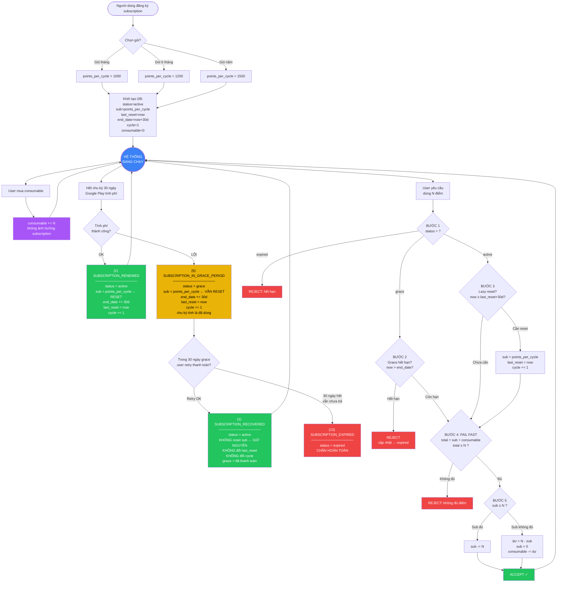

# 6. Thanh toán & Subscription (Google Play Billing)

Hệ thống điểm kép (dual credit):
- **Subscription points** (`sub_point_remaining`): reset mỗi 30 ngày theo chu kỳ subscription, trừ trước
- **Consumable points** (`consumable_point_remaining`): mua thêm, không bao giờ reset, trừ sau khi sub hết

## Luồng tổng quan

```
┌─────────────────────────────────────────────────────────────────┐
│  1. User mua subscription trên Google Play                      │
│  2. App nhận purchaseToken → gọi POST /api/subscription/verify  │
│  3. Backend verify với Google Play API → kích hoạt subscription  │
│  4. Backend gán sub_point_remaining = points_per_cycle           │
│                                                                  │
│  Sau đó (tự động, không cần app gọi):                           │
│  5. Google Play gửi RTDN qua Pub/Sub → POST /webhooks/google    │
│     - RENEWED(2): reset sub points, cycle+1                     │
│     - IN_GRACE(6): status=GRACE, vẫn reset sub points           │
│     - RECOVERED(1): status=ACTIVE, giữ nguyên points            │
│     - EXPIRED(13): chặn hoàn toàn, sub points = 0               │
│  6. Backend gửi FCM silent push → app sync trạng thái mới       │
│                                                                  │
│  Khi user dùng AI feature:                                       │
│  7. Backend lazy-check subscription + trừ sub trước, consumable  │
│     sau (real-time, không cron)                                  │
└─────────────────────────────────────────────────────────────────┘
```

## Cấu hình

- Hệ thống credit **luôn bật** (không cần toggle)
- `CREDIT_COST_*`: Chi phí cho từng action (override bằng env var, ví dụ `CREDIT_COST_FACESWAP=10`)
- `TIER_MULTIPLIER_*`: Hệ số theo tier (FREE=1.0, SUBSCRIBER=0.8)

### Chi phí mặc định (Default Credit Costs)

| Category | Action | Endpoint | Cost |
|----------|--------|----------|------|
| **Enhance** | Image Enhance | `/enhance` | 2 |
| | Image Restore | `/restore` | 2 |
| | HD 4K Upscale | `/upscaler4k` | 5 |
| **Portrait** | AI Beautify | `/beauty` | 2 |
| | AI Filter | `/filter` | 3 |
| | AI Avatar | `/faceswap` | 5 |
| | AI Expressions | `/expression` | 1 |
| | AI Hairstyles | `/hair-style` | 1 |
| | AI Aging | `/aging` | 1 |
| **Edit** | Remove Object | `/remove-object` | 1 |
| | AI Background | `/background` | 5 |
| | AI Expand | `/expand` | 2 |
| | AI Replace | `/replace-object` | 2 |
| | AI Remove Text | `/remove-text` | 1 |
| | AI Editor | `/editor` | 5 |

Chi phí thực tế = `CREDIT_COST_*` × `TIER_MULTIPLIER_*` (mặc định subscriber = 0.8× free)

## Subscription SKUs

| SKU | Điểm/chu kỳ (30 ngày) | Giá |
|-----|----------------------|-----|
| `sub_monthly` | 1000 | 99,000 VND/tháng |
| `sub_semi_annual` | 1200 | 499,000 VND/6 tháng |
| `sub_annual` | 1500 | 899,000 VND/năm |

## Consumable SKUs

| SKU | Điểm | Giá |
|-----|------|-----|
| `credits_10` | 10 | 22,000 VND |
| `credits_50` | 50 | 99,000 VND |
| `credits_100` | 100 | 176,000 VND |
| `credits_500` | 500 | 770,000 VND |

## Endpoints

### GET `/api/products` - Danh sách sản phẩm

**Auth:** API Key

```json
// Response
{
  "data": [
    {
      "sku": "credits_10",
      "type": "consumable",
      "credits": 10,
      "points_per_cycle": 0,
      "name": "10 Credits",
      "description": "Gói 10 credits",
      "price_micros": 22000000000,
      "currency": "VND"
    },
    {
      "sku": "sub_monthly",
      "type": "subscription",
      "credits": 0,
      "points_per_cycle": 1000,
      "name": "Monthly",
      "description": "Gói tháng - 1000 điểm/chu kỳ",
      "price_micros": 99000000000,
      "currency": "VND"
    }
  ],
  "status": "success",
  "code": 200
}
```

### GET `/api/user/balance?profile_id={id}` - Số dư điểm kép + trạng thái subscription

**Auth:** API Key

```json
// Response
{
  "data": {
    "sub_point_remaining": 800,
    "consumable_point_remaining": 50,
    "total_available": 850,
    "subscription_status": "ACTIVE",
    "total_credits_purchased": 100,
    "total_credits_spent": 50
  },
  "status": "success",
  "code": 200
}
```

`subscription_status`: `ACTIVE` | `GRACE` | `CANCELLED` | `EXPIRED` | `PAUSED` | `NONE`

### POST `/api/deposit` - Nạp consumable points (verify Google Play purchase)

**Auth:** API Key

Mua consumable → điểm vào `consumable_point_remaining` (không bao giờ reset).

```json
// Request
{
  "profile_id": "abc123",
  "sku": "credits_50",
  "purchase_token": "google-play-purchase-token",
  "order_id": "GPA.1234-5678-9012"
}

// Response (success)
{
  "data": {
    "payment_id": "pay_xxx",
    "credits_granted": 50,
    "status": "COMPLETED"
  },
  "status": "success",
  "code": 200
}
```

**Lưu ý:** Idempotent theo `order_id` - gọi lại với cùng order_id sẽ trả kết quả cũ.

### GET `/api/deposit/status/{order_id}` - Kiểm tra trạng thái nạp

**Auth:** API Key

```json
// Response
{
  "data": {
    "id": "pay_xxx",
    "profile_id": "abc123",
    "sku": "credits_50",
    "order_id": "GPA.1234-5678-9012",
    "status": "COMPLETED",
    "credits_granted": 50
  },
  "status": "success",
  "code": 200
}
```

### POST `/api/subscription/verify` - Kích hoạt subscription (app gọi sau khi mua trên Google Play)

**Auth:** API Key

**Luồng:** User mua subscription trên Google Play → app nhận `purchaseToken` → app gọi endpoint này → backend verify với Google Play API → kích hoạt + gán `sub_point_remaining = points_per_cycle`.

```json
// Request
{
  "profile_id": "abc123",
  "sku": "sub_monthly",
  "purchase_token": "google-play-subscription-token"
}

// Response
{
  "data": {
    "subscription_id": "sub_xxx",
    "points_per_cycle": 1000,
    "expires_at": 1742592000,
    "status": "ACTIVE"
  },
  "status": "success",
  "code": 200
}
```

### GET `/api/subscription/status?profile_id={id}` - Trạng thái subscription hiện tại

**Auth:** API Key

```json
// Response
{
  "data": {
    "id": "sub_xxx",
    "sku": "sub_monthly",
    "status": "ACTIVE",
    "auto_renewing": 1,
    "expires_at": 1742592000,
    "last_reset_at": 1740000000,
    "cycle_count_used": 3,
    "points_per_cycle": 1000,
    "cancelled_at": null
  },
  "status": "success",
  "code": 200
}
```

### POST `/webhooks/google` - Google Play RTDN Webhook

**Auth:** Shared secret (`GOOGLE_WEBHOOK_SECRET`)

Nhận thông báo từ Google Play qua Pub/Sub (RTDN). App **KHÔNG** gọi endpoint này — Google gọi tự động.

**Subscription events được xử lý:**

| Type | Event | Hành động |
|------|-------|-----------|
| 2 | RENEWED | status=ACTIVE, reset sub=points_per_cycle, cycle+1 |
| 6 | IN_GRACE_PERIOD | status=GRACE, reset sub=points_per_cycle, cycle+1 |
| 1 | RECOVERED | status=ACTIVE, KHÔNG reset, KHÔNG đổi cycle |
| 3 | CANCELED | status=CANCELLED, auto_renewing=0 |
| 13 | EXPIRED | status=EXPIRED, sub_point_remaining=0 |
| 12 | REVOKED | status=EXPIRED, sub_point_remaining=0 |
| 10 | PAUSED | status=PAUSED |

**One-time product events:**
- Refund (type 2): trừ `consumable_point_remaining` (clamp to 0)

## Trừ điểm trong AI Endpoints (Dual Credit Deduction)

Mỗi AI endpoint tự động trừ điểm theo 5 bước:

1. **Auth check** — verify profile token → fail = `INVALID_TOKEN`
2. **Profile check** — profile tồn tại? bị ban? → fail = `PROFILE_NOT_FOUND` / `ACCOUNT_BANNED`
3. **Subscription check:**
   - Có sub ON_HOLD → zero sub points, reason = `SUB_ON_HOLD`
   - Có sub GRACE nhưng hết hạn → mark EXPIRED, zero sub, reason = `SUB_GRACE_EXPIRED`
   - Có sub ACTIVE quá 30 ngày → lazy reset sub = points_per_cycle
   - Không có sub → zero sub points, reason = `SUB_NONE`
4. **Fail fast** — sub + consumable < cost → HTTP 402, reason = `INSUFFICIENT_CREDITS` (hoặc reason cụ thể hơn nếu do sub status)
5. **Trừ điểm** — sub trước, hết sub thì trừ consumable (atomic UPDATE với WHERE guard)

Nếu AI xử lý lỗi → hoàn điểm vào `consumable_point_remaining` (saga compensation).

### Response khi credit check thất bại (HTTP 400)

```json
{
  "data": null,
  "status": "error",
  "message": "Credit check failed",
  "code": 400,
  "reason": "INSUFFICIENT_CREDITS"
}
```

### Bảng `reason` codes

| reason | Ý nghĩa | App nên làm gì |
|--------|---------|-----------------|
| `INVALID_TOKEN` | Token xác thực sai | Re-login |
| `PROFILE_NOT_FOUND` | Profile không tồn tại | Tạo profile mới |
| `ACCOUNT_BANNED` | Tài khoản bị cấm | Hiện thông báo ban |
| `SUB_ON_HOLD` | Thanh toán bị giữ | Hiện "Cập nhật thanh toán" |
| `SUB_GRACE_EXPIRED` | Grace period hết | Hiện "Gia hạn subscription" |
| `SUB_NONE` | Không có subscription | Hiện "Mua subscription" hoặc "Mua credits" |
| `INSUFFICIENT_CREDITS` | Hết điểm | Hiện "Mua thêm credits" |
| `CONCURRENT_CONFLICT` | Trùng request | Retry 1 lần |

Chi phí = `CREDIT_COST_*` × `TIER_MULTIPLIER_*`

## Tiers

| Tier | Multiplier mặc định | Mô tả |
|------|---------------------|-------|
| free | 1.0 | Không có subscription |
| subscriber | 0.8 | Có subscription đang active/grace |

---
# Sơ Đồ Hệ Thống Điểm & Subscription

> **Nguồn Google Play chính thức:**
> [Integrate Billing Library](https://developer.android.com/google/play/billing/integrate) |
> [Backend Integration](https://developer.android.com/google/play/billing/backend) |
> [RTDN Reference](https://developer.android.com/google/play/billing/rtdn-reference) |
> [Subscription Lifecycle](https://developer.android.com/google/play/billing/lifecycle)

---

## LUỒNG 0: MUA & KÍCH HOẠT (CLIENT → BACKEND → GOOGLE)

> **Theo Google docs:** App nhận `purchaseToken` sau khi user mua → gửi token lên backend để verify.
> Xem: [Integrate - Process purchases](https://developer.android.com/google/play/billing/integrate#process),
> [Backend - Verify purchases](https://developer.android.com/google/play/billing/backend)

```
═══════════════════════════════════════════════════════════════════════════════
  LUỒNG 0A: MUA SUBSCRIPTION
═══════════════════════════════════════════════════════════════════════════════

  ┌──────────┐      ┌──────────────┐      ┌──────────────┐      ┌──────────┐
  │  USER    │      │  GOOGLE PLAY │      │   BACKEND    │      │  GOOGLE  │
  │  (App)   │      │  (trên máy)  │      │  (Worker)    │      │  API     │
  └────┬─────┘      └──────┬───────┘      └──────┬───────┘      └────┬─────┘
       │                   │                      │                   │
       │  1. Chọn gói      │                      │                   │
       │  sub_monthly      │                      │                   │
       │──────────────────>│                      │                   │
       │                   │                      │                   │
       │  2. Thanh toán    │                      │                   │
       │  Google xử lý     │                      │                   │
       │<──────────────────│                      │                   │
       │  purchaseToken ←──│                      │                   │
       │                   │                      │                   │
       │  3. POST /api/subscription/verify        │                   │
       │  { profile_id, sku, purchase_token }     │                   │
       │─────────────────────────────────────────>│                   │
       │                                          │                   │
       │                                          │  4. Verify token  │
       │                                          │──────────────────>│
       │                                          │  valid ✓          │
       │                                          │<──────────────────│
       │                                          │                   │
       │                                          │  5. Acknowledge   │
       │                                          │──────────────────>│
       │                                          │                   │
       │                                          │  6. DB update:    │
       │                                          │  subscription:    │
       │                                          │    status=ACTIVE  │
       │                                          │    points_per_    │
       │                                          │    cycle=1000     │
       │                                          │    last_reset=now │
       │                                          │  profile:         │
       │                                          │    sub_point=1000 │
       │                                          │                   │
       │  7. Response: { status: ACTIVE,          │                   │
       │     points_per_cycle: 1000 }             │                   │
       │<─────────────────────────────────────────│                   │
       │                                          │                   │
       │  8. App cập nhật UI                      │                   │
       │                                          │                   │

═══════════════════════════════════════════════════════════════════════════════
  LUỒNG 0B: MUA CONSUMABLE
═══════════════════════════════════════════════════════════════════════════════

  ┌──────────┐      ┌──────────────┐      ┌──────────────┐      ┌──────────┐
  │  USER    │      │  GOOGLE PLAY │      │   BACKEND    │      │  GOOGLE  │
  │  (App)   │      │  (trên máy)  │      │  (Worker)    │      │  API     │
  └────┬─────┘      └──────┬───────┘      └──────┬───────┘      └────┬─────┘
       │                   │                      │                   │
       │  1. Mua credits_50│                      │                   │
       │──────────────────>│                      │                   │
       │                   │                      │                   │
       │  2. purchaseToken │                      │                   │
       │<──────────────────│                      │                   │
       │                   │                      │                   │
       │  3. POST /api/deposit                    │                   │
       │  { profile_id, sku, purchase_token,      │                   │
       │    order_id }                            │                   │
       │─────────────────────────────────────────>│                   │
       │                                          │  4. Verify        │
       │                                          │──────────────────>│
       │                                          │  5. Acknowledge   │
       │                                          │──────────────────>│
       │                                          │                   │
       │                                          │  6. DB:           │
       │                                          │  consumable += 50 │
       │                                          │                   │
       │  7. { credits_granted: 50 }              │                   │
       │<─────────────────────────────────────────│                   │
       │                                          │                   │

═══════════════════════════════════════════════════════════════════════════════
  LUỒNG 0C: WEBHOOK RTDN (GOOGLE → BACKEND → APP qua FCM)
  Sau khi subscription đã active, các event tiếp theo Google gửi tự động
═══════════════════════════════════════════════════════════════════════════════

  ┌──────────┐      ┌──────────────┐      ┌──────────────┐
  │  APP     │      │  GOOGLE PLAY │      │   BACKEND    │
  │  (FCM)   │      │  (Pub/Sub)   │      │  (Worker)    │
  └────┬─────┘      └──────┬───────┘      └──────┬───────┘
       │                   │                      │
       │                   │  1. RTDN event       │
       │                   │  (RENEWED/GRACE/     │
       │                   │   EXPIRED/etc)       │
       │                   │─────────────────────>│
       │                   │  POST /webhooks/     │
       │                   │  google              │
       │                   │                      │
       │                   │                      │  2. Cập nhật DB
       │                   │                      │  (status, points,
       │                   │                      │   cycle, etc)
       │                   │                      │
       │  3. FCM silent push                      │
       │  { type: "subscription_update",          │
       │    status: "RENEWED" }                   │
       │<─────────────────────────────────────────│
       │                   │                      │
       │  4. App nhận FCM  │                      │
       │  → gọi GET /api/  │                      │
       │  user/balance để  │                      │
       │  sync UI          │                      │
       │                   │                      │
```

---

## TOÀN BỘ LUỒNG SAU KHI ĐÃ KÍCH HOẠT (ASCII)

```
                        ┌─────────────────────────────┐
                        │   SUBSCRIPTION ĐÃ ACTIVE    │
                        │   (sau luồng 0A ở trên)     │
                        └──────────────┬──────────────┘
                                       │
                                       ▼
                  ┌─────────────────────────────────────────┐
                  │            TRẠNG THÁI HIỆN TẠI          │
                  │                                         │
                  │  subscription:                          │
                  │    status = active                      │
                  │    sub_point_remaining = points_per_cycle│
                  │    last_reset_at = now                  │
                  │    end_date = now + 30 ngày             │
                  │    cycle_count_used = 1                 │
                  │                                         │
                  │  profile:                               │
                  │    consumable_point_remaining = 0       │
                  │    (tăng khi mua thêm, không bao giờ   │
                  │     reset, không phụ thuộc subscription)│
                  └──────────────────┬──────────────────────┘
                                     │
          ┌──────────────────────────┼──────────────────────────┐
          │                          │                          │
          ▼                          ▼                          ▼
┌──────────────────┐   ┌──────────────────────┐   ┌──────────────────────┐
│ USER DÙNG ĐIỂM  │   │ GOOGLE PLAY GỬI RTDN │   │ USER MUA CONSUMABLE  │
│ (xem luồng bên  │   │ (xem luồng bên dưới) │   │ (luồng 0B ở trên)   │
│  dưới)           │   │                       │   │ consumable += N      │
└──────────────────┘   └───────────────────────┘   └──────────────────────┘


═══════════════════════════════════════════════════════════════════════════════
  LUỒNG 1: GOOGLE PLAY RTDN → CẬP NHẬT TRẠNG THÁI
═══════════════════════════════════════════════════════════════════════════════

                         Hết chu kỳ 30 ngày
                         Google Play tính phí
                                 │
                    ┌────────────┴────────────┐
                    │                         │
               Tính phí OK              Tính phí LỖI
                    │                         │
                    ▼                         ▼
  ┌──────────────────────────┐  ┌──────────────────────────────┐
  │ (2) SUBSCRIPTION_RENEWED │  │(6) SUBSCRIPTION_IN_GRACE_    │
  │                          │  │    PERIOD                    │
  │ status = active          │  │                              │
  │ end_date += 30 ngày      │  │ status = grace               │
  │ sub = points_per_cycle   │  │ end_date += 30 ngày          │
  │ last_reset_at = now      │  │ sub = points_per_cycle ←RESET│
  │ cycle_count_used += 1    │  │ last_reset_at = now          │
  │                          │  │ cycle_count_used += 1        │
  │ → RESET điểm             │  │                              │
  │ → chu kỳ mới             │  │ → VẪN RESET điểm            │
  │ → tiếp tục bình thường   │  │ → chu kỳ mới (tính đã dùng) │
  └────────────┬─────────────┘  │ → user vẫn dùng được điểm   │
               │                └──────────────┬───────────────┘
               │                               │
               │                    ┌──────────┴──────────┐
               │                    │                     │
               │               Retry OK            Grace hết,
               │               trong grace         vẫn chưa trả
               │                    │                     │
               │                    ▼                     ▼
               │  ┌───────────────────────┐  ┌────────────────────────┐
               │  │(1) SUBSCRIPTION_      │  │(5) SUBSCRIPTION_       │
               │  │    RECOVERED          │  │    ON_HOLD             │
               │  │                       │  │                        │
               │  │ status = active       │  │ status = on_hold       │
               │  │ KHÔNG reset sub       │  │ sub_point = 0 ← MẤT   │
               │  │ KHÔNG đổi last_reset  │  │ user MẤT quyền truy   │
               │  │ KHÔNG đổi cycle       │  │ cập NGAY LẬP TỨC      │
               │  │                       │  │                        │
               │  │ → giữ nguyên điểm     │  │                        │
               │  │ → grace = đã thanh    │  └──────────┬─────────────┘
               │  │   toán                │             │
               │  └───────────┬───────────┘  ┌──────────┴──────────┐
               │              │              │                     │
               │              │         Retry OK trong       60 ngày hết,
               │              │         account hold         vẫn chưa trả
               │              │              │                     │
               │              │              ▼                     ▼
               │              │  ┌───────────────────┐  ┌────────────────────┐
               │              │  │(1) RECOVERED      │  │(13) EXPIRED        │
               │              │  │ từ ON_HOLD        │  │                    │
               │              │  │                   │  │ status = expired   │
               │              │  │ status = active   │  │ CHẶN HOÀN TOÀN    │
               │              │  │ restore sub points│  │ sub_point = 0     │
               │              │  └────────┬──────────┘  └────────────────────┘
               │              │           │
               └──────┬───────┴───────────┘
                      │
                      ▼
              Quay lại đầu chu kỳ
              (chờ 30 ngày tiếp)


═══════════════════════════════════════════════════════════════════════════════
  LUỒNG 2: USER DÙNG N ĐIỂM → XỬ LÝ REAL-TIME (KHÔNG CRON)
═══════════════════════════════════════════════════════════════════════════════

                      User yêu cầu dùng N điểm
                                 │
                                 ▼
                ┌────────────────────────────────┐
                │  BƯỚC 1: Kiểm tra status       │
                └───────────────┬────────────────┘
                                │
              ┌─────────────────┼─────────────────┐
              │                 │                  │
           expired         active              grace
              │                 │                  │
              ▼                 │                  ▼
        ╔═══════════╗          │    ┌──────────────────────────┐
        ║  REJECT   ║          │    │ BƯỚC 2: Grace hết hạn?  │
        ║  hết hạn  ║          │    │ now > end_date ?         │
        ╚═══════════╝          │    └─────────────┬────────────┘
                               │           ┌──────┴──────┐
                               │           │             │
                               │         CÓ (hết)    KHÔNG (còn)
                               │           │             │
                               │           ▼             │
                               │    ╔═══════════╗       │
                               │    ║  REJECT   ║       │
                               │    ║→ expired  ║       │
                               │    ╚═══════════╝       │
                               │                        │
                               └───────────┬────────────┘
                                           │
                                           ▼
                          ┌─────────────────────────────────┐
                          │ BƯỚC 3: Lazy reset chu kỳ       │
                          │ (CHỈ khi status = active)       │
                          │                                 │
                          │ now ≥ last_reset_at + 30 ngày ? │
                          └───────────────┬─────────────────┘
                                   ┌──────┴──────┐
                                   │             │
                                 CÓ           KHÔNG
                                   │             │
                                   ▼             │
                          ┌──────────────────┐   │
                          │ sub = points_per │   │
                          │     _cycle       │   │
                          │ last_reset = now │   │
                          │ cycle += 1       │   │
                          └────────┬─────────┘   │
                                   │             │
                                   └──────┬──────┘
                                          │
                                          ▼
                          ┌────────────────────────────────┐
                          │ BƯỚC 4: FAIL FAST              │
                          │                                │
                          │ total = sub + consumable       │
                          │ total ≥ N ?                    │
                          └───────────────┬────────────────┘
                                   ┌──────┴──────┐
                                   │             │
                               KHÔNG            CÓ
                                   │             │
                                   ▼             ▼
                          ╔═══════════╗  ┌──────────────────────┐
                          ║  REJECT   ║  │ BƯỚC 5: Trừ điểm    │
                          ║ không đủ  ║  │ (sub trước,          │
                          ╚═══════════╝  │  consumable sau)     │
                                         └──────────┬───────────┘
                                              ┌─────┴─────┐
                                              │           │
                                         sub ≥ N      sub < N
                                              │           │
                                              ▼           ▼
                                     ┌────────────┐ ┌─────────────────┐
                                     │ sub -= N   │ │ dư = N - sub    │
                                     │            │ │ sub = 0         │
                                     │            │ │ consumable -= dư│
                                     └─────┬──────┘ └────────┬────────┘
                                           │                 │
                                           └────────┬────────┘
                                                    │
                                                    ▼
                                           ╔═══════════════╗
                                           ║  ACCEPT  ✓    ║
                                           ╚═══════════════╝
```

---

## TOÀN BỘ LUỒNG (MERMAID)


