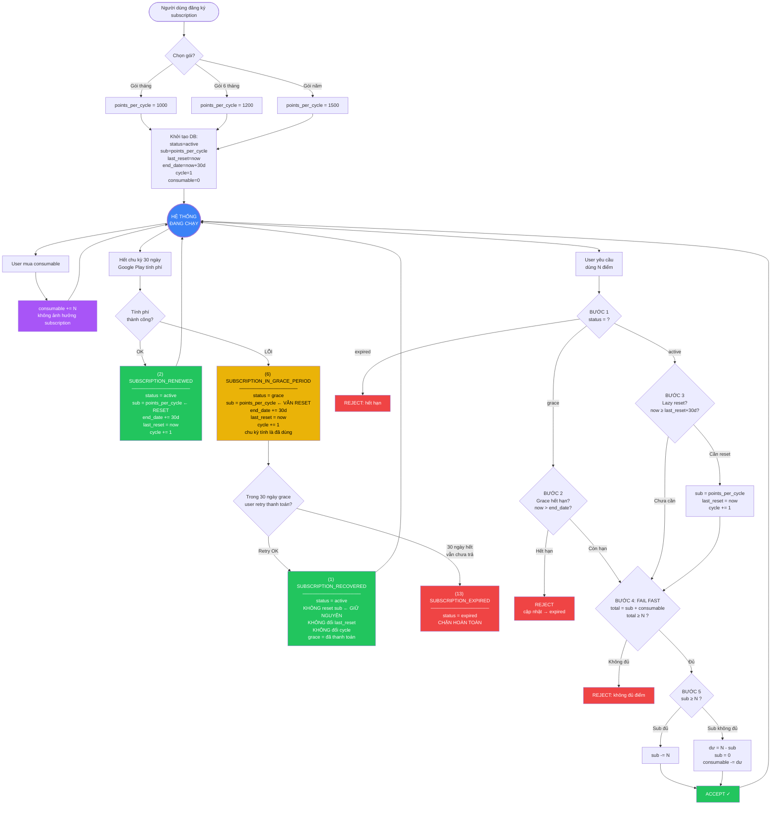

# Sơ Đồ Hệ Thống Điểm & Subscription

> **Nguồn Google Play chính thức:**
> [Integrate Billing Library](https://developer.android.com/google/play/billing/integrate) |
> [Backend Integration](https://developer.android.com/google/play/billing/backend) |
> [RTDN Reference](https://developer.android.com/google/play/billing/rtdn-reference) |
> [Subscription Lifecycle](https://developer.android.com/google/play/billing/lifecycle)

---

## LUỒNG 0: MUA & KÍCH HOẠT (CLIENT → BACKEND → GOOGLE)

> **Theo Google docs:** App nhận `purchaseToken` sau khi user mua → gửi token lên backend để verify.
> Xem: [Integrate - Process purchases](https://developer.android.com/google/play/billing/integrate#process),
> [Backend - Verify purchases](https://developer.android.com/google/play/billing/backend)

```
═══════════════════════════════════════════════════════════════════════════════
  LUỒNG 0A: MUA SUBSCRIPTION
═══════════════════════════════════════════════════════════════════════════════

  ┌──────────┐      ┌──────────────┐      ┌──────────────┐      ┌──────────┐
  │  USER    │      │  GOOGLE PLAY │      │   BACKEND    │      │  GOOGLE  │
  │  (App)   │      │  (trên máy)  │      │  (Worker)    │      │  API     │
  └────┬─────┘      └──────┬───────┘      └──────┬───────┘      └────┬─────┘
       │                   │                      │                   │
       │  1. Chọn gói      │                      │                   │
       │  sub_monthly      │                      │                   │
       │──────────────────>│                      │                   │
       │                   │                      │                   │
       │  2. Thanh toán    │                      │                   │
       │  Google xử lý     │                      │                   │
       │<──────────────────│                      │                   │
       │  purchaseToken ←──│                      │                   │
       │                   │                      │                   │
       │  3. POST /api/subscription/verify        │                   │
       │  { profile_id, sku, purchase_token }     │                   │
       │─────────────────────────────────────────>│                   │
       │                                          │                   │
       │                                          │  4. Verify token  │
       │                                          │──────────────────>│
       │                                          │  valid ✓          │
       │                                          │<──────────────────│
       │                                          │                   │
       │                                          │  5. Acknowledge   │
       │                                          │──────────────────>│
       │                                          │                   │
       │                                          │  6. DB update:    │
       │                                          │  subscription:    │
       │                                          │    status=ACTIVE  │
       │                                          │    points_per_    │
       │                                          │    cycle=1000     │
       │                                          │    last_reset=now │
       │                                          │  profile:         │
       │                                          │    sub_point=1000 │
       │                                          │                   │
       │  7. Response: { status: ACTIVE,          │                   │
       │     points_per_cycle: 1000 }             │                   │
       │<─────────────────────────────────────────│                   │
       │                                          │                   │
       │  8. App cập nhật UI                      │                   │
       │                                          │                   │

═══════════════════════════════════════════════════════════════════════════════
  LUỒNG 0B: MUA CONSUMABLE
═══════════════════════════════════════════════════════════════════════════════

  ┌──────────┐      ┌──────────────┐      ┌──────────────┐      ┌──────────┐
  │  USER    │      │  GOOGLE PLAY │      │   BACKEND    │      │  GOOGLE  │
  │  (App)   │      │  (trên máy)  │      │  (Worker)    │      │  API     │
  └────┬─────┘      └──────┬───────┘      └──────┬───────┘      └────┬─────┘
       │                   │                      │                   │
       │  1. Mua credits_50│                      │                   │
       │──────────────────>│                      │                   │
       │                   │                      │                   │
       │  2. purchaseToken │                      │                   │
       │<──────────────────│                      │                   │
       │                   │                      │                   │
       │  3. POST /api/deposit                    │                   │
       │  { profile_id, sku, purchase_token,      │                   │
       │    order_id }                            │                   │
       │─────────────────────────────────────────>│                   │
       │                                          │  4. Verify        │
       │                                          │──────────────────>│
       │                                          │  5. Acknowledge   │
       │                                          │──────────────────>│
       │                                          │                   │
       │                                          │  6. DB:           │
       │                                          │  consumable += 50 │
       │                                          │                   │
       │  7. { credits_granted: 50 }              │                   │
       │<─────────────────────────────────────────│                   │
       │                                          │                   │

═══════════════════════════════════════════════════════════════════════════════
  LUỒNG 0C: WEBHOOK RTDN (GOOGLE → BACKEND → APP qua FCM)
  Sau khi subscription đã active, các event tiếp theo Google gửi tự động
═══════════════════════════════════════════════════════════════════════════════

  ┌──────────┐      ┌──────────────┐      ┌──────────────┐
  │  APP     │      │  GOOGLE PLAY │      │   BACKEND    │
  │  (FCM)   │      │  (Pub/Sub)   │      │  (Worker)    │
  └────┬─────┘      └──────┬───────┘      └──────┬───────┘
       │                   │                      │
       │                   │  1. RTDN event       │
       │                   │  (RENEWED/GRACE/     │
       │                   │   EXPIRED/etc)       │
       │                   │─────────────────────>│
       │                   │  POST /webhooks/     │
       │                   │  google              │
       │                   │                      │
       │                   │                      │  2. Cập nhật DB
       │                   │                      │  (status, points,
       │                   │                      │   cycle, etc)
       │                   │                      │
       │  3. FCM silent push                      │
       │  { type: "subscription_update",          │
       │    status: "RENEWED" }                   │
       │<─────────────────────────────────────────│
       │                   │                      │
       │  4. App nhận FCM  │                      │
       │  → gọi GET /api/  │                      │
       │  user/balance để  │                      │
       │  sync UI          │                      │
       │                   │                      │
```

---

## TOÀN BỘ LUỒNG SAU KHI ĐÃ KÍCH HOẠT (ASCII)

```
                        ┌─────────────────────────────┐
                        │   SUBSCRIPTION ĐÃ ACTIVE    │
                        │   (sau luồng 0A ở trên)     │
                        └──────────────┬──────────────┘
                                       │
                                       ▼
                  ┌─────────────────────────────────────────┐
                  │            TRẠNG THÁI HIỆN TẠI          │
                  │                                         │
                  │  subscription:                          │
                  │    status = active                      │
                  │    sub_point_remaining = points_per_cycle│
                  │    last_reset_at = now                  │
                  │    end_date = now + 30 ngày             │
                  │    cycle_count_used = 1                 │
                  │                                         │
                  │  profile:                               │
                  │    consumable_point_remaining = 0       │
                  │    (tăng khi mua thêm, không bao giờ   │
                  │     reset, không phụ thuộc subscription)│
                  └──────────────────┬──────────────────────┘
                                     │
          ┌──────────────────────────┼──────────────────────────┐
          │                          │                          │
          ▼                          ▼                          ▼
┌──────────────────┐   ┌──────────────────────┐   ┌──────────────────────┐
│ USER DÙNG ĐIỂM  │   │ GOOGLE PLAY GỬI RTDN │   │ USER MUA CONSUMABLE  │
│ (xem luồng bên  │   │ (xem luồng bên dưới) │   │ (luồng 0B ở trên)   │
│  dưới)           │   │                       │   │ consumable += N      │
└──────────────────┘   └───────────────────────┘   └──────────────────────┘


═══════════════════════════════════════════════════════════════════════════════
  LUỒNG 1: GOOGLE PLAY RTDN → CẬP NHẬT TRẠNG THÁI
═══════════════════════════════════════════════════════════════════════════════

                         Hết chu kỳ 30 ngày
                         Google Play tính phí
                                 │
                    ┌────────────┴────────────┐
                    │                         │
               Tính phí OK              Tính phí LỖI
                    │                         │
                    ▼                         ▼
  ┌──────────────────────────┐  ┌──────────────────────────────┐
  │ (2) SUBSCRIPTION_RENEWED │  │(6) SUBSCRIPTION_IN_GRACE_    │
  │                          │  │    PERIOD                    │
  │ status = active          │  │                              │
  │ end_date += 30 ngày      │  │ status = grace               │
  │ sub = points_per_cycle   │  │ end_date += 30 ngày          │
  │ last_reset_at = now      │  │ sub = points_per_cycle ←RESET│
  │ cycle_count_used += 1    │  │ last_reset_at = now          │
  │                          │  │ cycle_count_used += 1        │
  │ → RESET điểm             │  │                              │
  │ → chu kỳ mới             │  │ → VẪN RESET điểm            │
  │ → tiếp tục bình thường   │  │ → chu kỳ mới (tính đã dùng) │
  └────────────┬─────────────┘  │ → user vẫn dùng được điểm   │
               │                └──────────────┬───────────────┘
               │                               │
               │                    ┌──────────┴──────────┐
               │                    │                     │
               │               Retry OK            Grace hết,
               │               trong grace         vẫn chưa trả
               │                    │                     │
               │                    ▼                     ▼
               │  ┌───────────────────────┐  ┌────────────────────────┐
               │  │(1) SUBSCRIPTION_      │  │(5) SUBSCRIPTION_       │
               │  │    RECOVERED          │  │    ON_HOLD             │
               │  │                       │  │                        │
               │  │ status = active       │  │ status = on_hold       │
               │  │ KHÔNG reset sub       │  │ sub_point = 0 ← MẤT   │
               │  │ KHÔNG đổi last_reset  │  │ user MẤT quyền truy   │
               │  │ KHÔNG đổi cycle       │  │ cập NGAY LẬP TỨC      │
               │  │                       │  │                        │
               │  │ → giữ nguyên điểm     │  │                        │
               │  │ → grace = đã thanh    │  └──────────┬─────────────┘
               │  │   toán                │             │
               │  └───────────┬───────────┘  ┌──────────┴──────────┐
               │              │              │                     │
               │              │         Retry OK trong       60 ngày hết,
               │              │         account hold         vẫn chưa trả
               │              │              │                     │
               │              │              ▼                     ▼
               │              │  ┌───────────────────┐  ┌────────────────────┐
               │              │  │(1) RECOVERED      │  │(13) EXPIRED        │
               │              │  │ từ ON_HOLD        │  │                    │
               │              │  │                   │  │ status = expired   │
               │              │  │ status = active   │  │ CHẶN HOÀN TOÀN    │
               │              │  │ restore sub points│  │ sub_point = 0     │
               │              │  └────────┬──────────┘  └────────────────────┘
               │              │           │
               └──────┬───────┴───────────┘
                      │
                      ▼
              Quay lại đầu chu kỳ
              (chờ 30 ngày tiếp)


═══════════════════════════════════════════════════════════════════════════════
  LUỒNG 2: USER DÙNG N ĐIỂM → XỬ LÝ REAL-TIME (KHÔNG CRON)
═══════════════════════════════════════════════════════════════════════════════

                      User yêu cầu dùng N điểm
                                 │
                                 ▼
                ┌────────────────────────────────┐
                │  BƯỚC 1: Kiểm tra status       │
                └───────────────┬────────────────┘
                                │
              ┌─────────────────┼─────────────────┐
              │                 │                  │
           expired         active              grace
              │                 │                  │
              ▼                 │                  ▼
        ╔═══════════╗          │    ┌──────────────────────────┐
        ║  REJECT   ║          │    │ BƯỚC 2: Grace hết hạn?  │
        ║  hết hạn  ║          │    │ now > end_date ?         │
        ╚═══════════╝          │    └─────────────┬────────────┘
                               │           ┌──────┴──────┐
                               │           │             │
                               │         CÓ (hết)    KHÔNG (còn)
                               │           │             │
                               │           ▼             │
                               │    ╔═══════════╗       │
                               │    ║  REJECT   ║       │
                               │    ║→ expired  ║       │
                               │    ╚═══════════╝       │
                               │                        │
                               └───────────┬────────────┘
                                           │
                                           ▼
                          ┌─────────────────────────────────┐
                          │ BƯỚC 3: Lazy reset chu kỳ       │
                          │ (CHỈ khi status = active)       │
                          │                                 │
                          │ now ≥ last_reset_at + 30 ngày ? │
                          └───────────────┬─────────────────┘
                                   ┌──────┴──────┐
                                   │             │
                                 CÓ           KHÔNG
                                   │             │
                                   ▼             │
                          ┌──────────────────┐   │
                          │ sub = points_per │   │
                          │     _cycle       │   │
                          │ last_reset = now │   │
                          │ cycle += 1       │   │
                          └────────┬─────────┘   │
                                   │             │
                                   └──────┬──────┘
                                          │
                                          ▼
                          ┌────────────────────────────────┐
                          │ BƯỚC 4: FAIL FAST              │
                          │                                │
                          │ total = sub + consumable       │
                          │ total ≥ N ?                    │
                          └───────────────┬────────────────┘
                                   ┌──────┴──────┐
                                   │             │
                               KHÔNG            CÓ
                                   │             │
                                   ▼             ▼
                          ╔═══════════╗  ┌──────────────────────┐
                          ║  REJECT   ║  │ BƯỚC 5: Trừ điểm    │
                          ║ không đủ  ║  │ (sub trước,          │
                          ╚═══════════╝  │  consumable sau)     │
                                         └──────────┬───────────┘
                                              ┌─────┴─────┐
                                              │           │
                                         sub ≥ N      sub < N
                                              │           │
                                              ▼           ▼
                                     ┌────────────┐ ┌─────────────────┐
                                     │ sub -= N   │ │ dư = N - sub    │
                                     │            │ │ sub = 0         │
                                     │            │ │ consumable -= dư│
                                     └─────┬──────┘ └────────┬────────┘
                                           │                 │
                                           └────────┬────────┘
                                                    │
                                                    ▼
                                           ╔═══════════════╗
                                           ║  ACCEPT  ✓    ║
                                           ╚═══════════════╝
```

---

## TOÀN BỘ LUỒNG (MERMAID)


